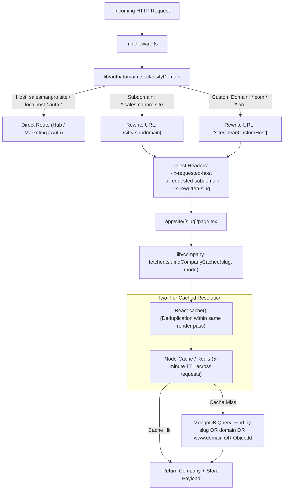
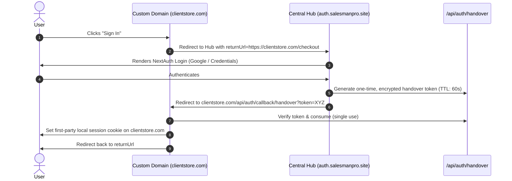
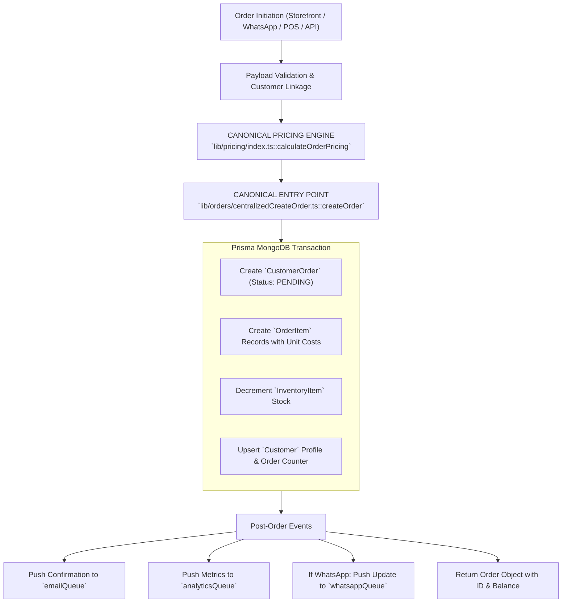
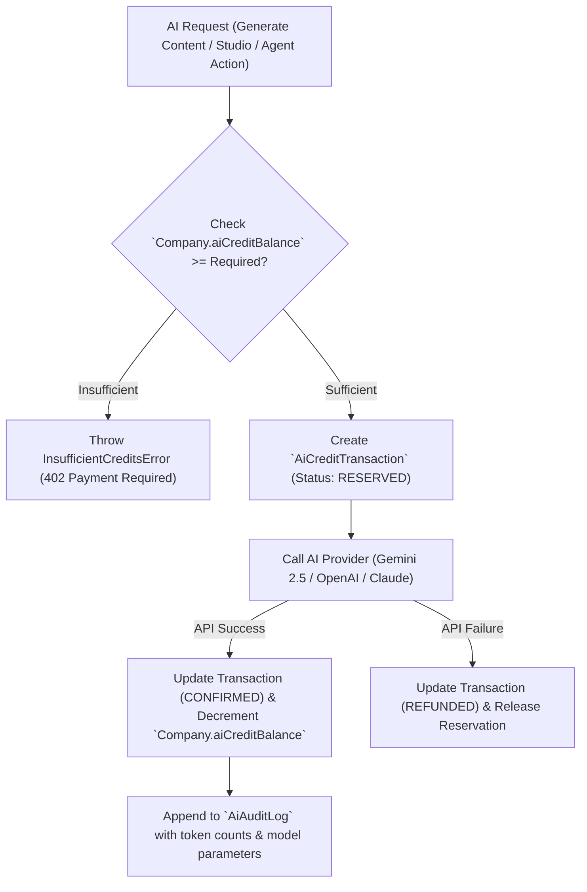
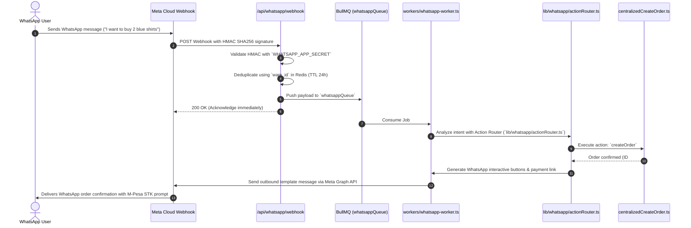
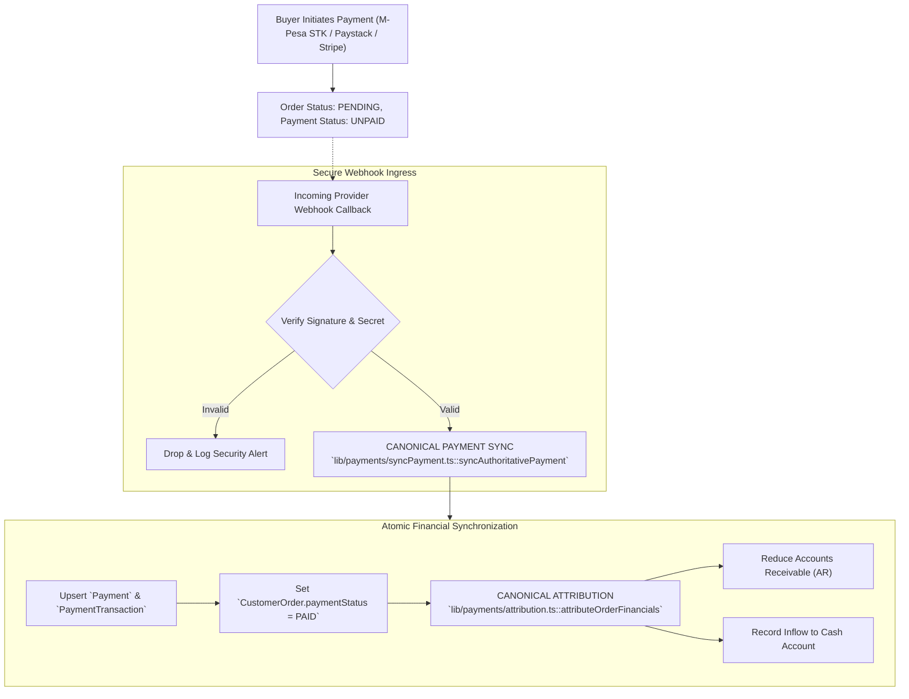

# SalesmanPro — Canonical Architecture & System Knowledge Map

> **Authoritative System Architecture Map**  
> **Architecture Map Version:** 1.0.0  
> **Last Verified:** 2026-09-18  
> **Verified Against Commit:** `07631848e3f8fc1a6f4df711df1ca568f7cdc8d7`  
> **Primary Maintainer:** Core Engineering & Autonomous Agents  

---

## 1. Executive Purpose & How to Use This Map

This document is the **primary authoritative architectural reference** for the SalesmanPro platform. Its purpose is to eliminate repetitive, full-codebase rescanning and prevent regressions across interconnected multi-tenant, commerce, AI, WhatsApp, and background job systems.

### The Standard Engineering Workflow
Every new feature, bug fix, or refactor **must follow this navigation chain**:

```text
Feature Request
   ↓
Look up Feature in Section 18 (Feature-to-Code Index)
   ↓
Identify Subsystem in Section 3 (System Registry)
   ↓
Check Canonical Entry Points in Section 20 (Canonical Implementations)
   ↓
Review Invariants & Impact Warnings in Section 21 & 22 ("If You Change This...")
   ↓
Inspect ONLY the relevant files identified
   ↓
Implement & Verify against Critical User Paths (Section 23)
   ↓
Update this Architecture Map if boundaries, models, or queues changed
```

---

## 2. High-Level System Architecture Diagram

```mermaid
flowchart TD
    subgraph Clients["Clients & Ingress Channels"]
        U_Web["Web Browsers (Storefronts & Hub)"]
        U_Mobile["Mobile Web / PWA"]
        U_POS["Physical POS Terminals"]
        U_WA["WhatsApp Users (Meta Ingress)"]
        U_Ext["External Webhook Callbacks (Stripe / Paystack / M-Pesa)"]
    end

    subgraph Edge["Edge Routing & Ingress Layer"]
        MW["Next.js Edge Middleware (`middleware.ts`)"]
        HostClassifier["Domain Classifier (`lib/auth/domain.ts`)"]
        MW --> HostClassifier
    end

    U_Web --> MW
    U_Mobile --> MW
    U_POS --> MW
    U_Ext --> MW
    U_WA --> MW

    subgraph NextServer["Next.js App Server (App Router & APIs)"]
        subgraph TenantResolution["Tenant & Store Resolution Layer"]
            CompanyFetcher["Company Fetcher (`lib/company-fetcher.ts`)\n`findCompanyCached` (LRU + React Cache)"]
            StoreCtx["StoreContext Provider (`contexts/StoreContext.tsx`)"]
        end

        subgraph RoutingDestinations["Routing Targets"]
            HubApp["Platform Hub & Landing (`app/page.tsx`)"]
            AuthSystem["Auth Engine (`app/auth/*`, `lib/auth.ts`)"]
            AdminDash["Multi-Tenant Admin & POS (`app/admin/*`, `app/pos/*`)"]
            GhubaMarket["Ghuba Marketplace (`app/ghuba/*`, `app/site/ghuba/*`)"]
            StorefrontApp["Storefront Engine (`app/site/[slug]/*`)\n56 Dynamic Theme Layouts"]
            APIRoutes["API Endpoints (`app/api/*`)"]
        end

        subgraph CoreServices["Canonical Business Services Layer"]
            OrderService["Canonical Order Service (`lib/orders/centralizedCreateOrder.ts`)"]
            PricingService["Pricing Engine (`lib/pricing/index.ts`)"]
            PaymentSync["Authoritative Payment Sync (`lib/payments/syncPayment.ts`)"]
            FinanceEngine["Financial & Accounting Engine (`lib/finance/financeService.ts`)"]
            InventoryEngine["Inventory & Stock Management (`prisma.inventoryItem`)"]
            SearchService["Search & Discovery (`app/api/search`, `/api/ghuba/search`)"]
            AIRouter["AI Studio & Workforce (`lib/ai/`, `workers/ai-job-worker.ts`)"]
            WhatsAppRouter["WhatsApp Action Router (`lib/whatsapp/actionRouter.ts`)"]
        end
    end

    MW -- "Hub / Root" --> HubApp
    MW -- "Rewritten to /site/[slug]" --> StorefrontApp
    MW -- "Auth Handover / Session" --> AuthSystem
    MW -- "Admin / SuperAdmin" --> AdminDash
    MW -- "Ghuba Routes" --> GhubaMarket
    MW -- "REST / Webhooks" --> APIRoutes

    StorefrontApp --> CompanyFetcher --> StoreCtx
    StorefrontApp --> OrderService
    OrderService --> PricingService
    AdminDash --> FinanceEngine
    AdminDash --> InventoryEngine
    APIRoutes --> PaymentSync
    APIRoutes --> WhatsAppRouter
    WhatsAppRouter --> OrderService

    subgraph Persistence["State & Persistence Tier"]
        MongoDB[("MongoDB Primary Store\n(via Prisma ORM 11.4k LOC Schema)")]
        RedisCache[("Redis Cache Cluster\n(Upstash / Local ioredis)")]
        BullMQQ[("BullMQ Queue Broker\n(11 Dedicated Processing Queues)")]
    end

    CoreServices --> MongoDB
    CoreServices --> RedisCache
    CoreServices --> BullMQQ

    subgraph BackgroundWorkers["Decoupled Background Workers (`workers/`)"]
        W_WA["whatsapp-worker.ts"]
        W_AI["ai-job-worker.ts & ai-workforce-worker.ts"]
        W_Media["MediaJob.ts"]
        W_Analytics["analytics-worker.ts"]
        W_Backup["backup-worker.ts"]
        W_Social["social-worker.ts"]
        W_Domain["domain-ssl-worker.ts"]
        W_Reconcile["reconcileOrders.ts"]
    end

    BullMQQ --> BackgroundWorkers
    BackgroundWorkers --> MongoDB
    BackgroundWorkers --> RedisCache

    subgraph Integrations["External Service Integrations"]
        Ext_Meta["Meta Cloud WhatsApp API"]
        Ext_Payments["M-Pesa / Paystack / Stripe / PayPal"]
        Ext_AI["Gemini 2.5 / OpenAI / Anthropic"]
        Ext_Cloudinary["Cloudinary / S3 Media CDN"]
        Ext_Email["Resend / SendGrid / SMTP"]
    end

    W_WA <--> Ext_Meta
    PaymentSync <--> Ext_Payments
    W_AI <--> Ext_AI
    W_Media <--> Ext_Cloudinary
    BackgroundWorkers <--> Ext_Email
```



---

## 3. System Registry

| Subsystem | Primary Purpose | Key Entry Points | Main Components | Authoritative APIs | Database Models | Core Dependencies |
| :--- | :--- | :--- | :--- | :--- | :--- | :--- |
| **Authentication** | Login, OAuth, cross-domain sessions | `lib/auth.ts`, `app/auth/signin/page.tsx` | `SignInModal`, `AuthProvider`, `withApiHandler` | `/api/auth/[...nextauth]`, `/api/auth/handover` | `User`, `Account`, `Session`, `VerificationToken` | NextAuth.js, JWT, bcryptjs |
| **Tenant & Domain Engine** | Hostname routing, custom domain SSL, multi-tenancy | `middleware.ts`, `lib/company-fetcher.ts`, `lib/auth/domain.ts` | `StoreContext.tsx`, `siteLayoutMap.ts` | `/api/companies`, `/api/site/[slug]` | `Company`, `Store`, `CustomDomain`, `CompanySettings` | Edge Middleware, Node-Cache/Redis |
| **Storefront Engine** | Renders 56 vertical industry e-commerce storefronts | `app/site/[slug]/page.tsx`, `components/site/layouts/*` | `SiteComponent`, `Header`, `Footer`, `Hero`, specialized cards | `/api/site/[slug]/*`, `/api/site/[slug]/me/*` | `Product`, `Category`, `CustomerOrder`, `Review` | TanStack Virtual, Framer Motion |
| **Commerce & Orders** | Cart, checkout, canonical order lifecycle, stock management | `lib/orders/centralizedCreateOrder.ts`, `lib/pricing/index.ts` | `CartDrawer`, `CheckoutForm`, `OrderTracker` | `/api/orders`, `/api/site/[slug]/checkout` | `CustomerOrder`, `OrderItem`, `Product`, `InventoryItem` | MongoDB Transactions, Prisma |
| **Finance & Accounting** | P&L, Cash Flow, balance sheet, AR, AP, tax & valuation | `lib/finance/financeService.ts`, `app/admin/finance/*` | `FinanceDashboard`, `PLStatement`, `TaxSummary` | `/api/finance/pl`, `/api/finance/cashflow`, `/api/finance/ar` | `CustomerOrder`, `PurchaseOrder`, `Expense`, `Invoice` | BigNumber.js, Prisma aggregations |
| **Payments & Attribution** | Payment processing, webhooks, financial ledger attribution | `lib/payments/syncPayment.ts`, `lib/payments/attribution.ts` | `PaymentModal`, `MpesaPrompt`, `StripeCard` | `/api/payments/*`, `/api/webhooks/mpesa`, `/api/webhooks/stripe` | `Payment`, `PaymentTransaction`, `CustomerOrder` | Safaricom Daraja, Paystack, Stripe SDK |
| **Ghuba Marketplace** | Multi-vendor central marketplace & discovery portal | `app/ghuba/page.tsx`, `app/site/ghuba/page.tsx` | `GhubaLayout`, `MarketplaceCard`, `GhubaFilter` | `/api/ghuba/search`, `/api/ghuba/recommendations` | `MarketplaceListing`, `MarketplaceCategory`, `Product` | Prisma, Force-dynamic SSR |
| **Search & Discovery** | Debounced catalog search, faceted filter, virtual lists | `app/api/search/route.ts`, `app/api/ghuba/search/route.ts` | `SearchBar`, `FilterSidebar`, `VirtualizedGrid` | `/api/search`, `/api/ghuba/search`, `/api/stores/[id]/search` | `Product`, `MarketplaceListing` | MongoDB Text Indexes, TanStack Virtual |
| **AI Studio & Workforce** | AI content gen, autonomous agents, credit billing | `lib/ai/`, `workers/ai-job-worker.ts`, `app/admin/ai/*` | `AIStudioChat`, `AgentDashboard`, `CreditBadge` | `/api/ai/generate`, `/api/ai/workforce`, `/api/ai/credits` | `AiAuditLog`, `AiCreditTransaction`, `Company.aiCreditBalance` | Google GenAI SDK, OpenAI SDK, BullMQ |
| **WhatsApp Commerce** | Two-way automated conversational commerce & AI bot | `app/api/whatsapp/webhook/route.ts`, `workers/whatsapp-worker.ts` | `WhatsAppChatWidget`, `WebhookValidator` | `/api/whatsapp/webhook`, `/api/whatsapp/send` | `WhatsAppConversation`, `WhatsAppMessage`, `CustomerOrder` | Meta Graph API, BullMQ, HMAC SHA256 |
| **Media Pipeline** | Multi-tenant media library, Cloudinary/S3 upload, AI tags | `lib/media/queues.ts`, `workers/MediaJob.ts`, `app/admin/media/*` | `MediaPickerModal`, `MediaUploader`, `ImageOptimizer` | `/api/media/upload`, `/api/media/assets` | `MediaItem`, `MediaAlbum`, `MediaAsset` | Cloudinary SDK, AWS S3, BullMQ |
| **POS System** | Fast physical store checkout, receipt printing, cash drawer | `app/pos/page.tsx`, `lib/pos/posService.ts` | `POSRegister`, `BarcodeScanner`, `ReceiptPrinter` | `/api/pos/orders`, `/api/pos/shift` | `CustomerOrder`, `InventoryItem`, `User` | WebUSB, Canvas, WebSocket |
| **School Management** | Student grading, fee collection, classroom attendance | `app/school/*`, `lib/school/schoolService.ts` | `GradeBook`, `FeeCollector`, `AttendanceRoster` | `/api/school/*` | `Student`, `Classroom`, `FeeRecord`, `Attendance` | Prisma relational domains |

---

## 4. Storefront Architecture & Theme Catalog

The storefront engine powers 56 distinct vertical themes. Every incoming request resolves a company, inspects its `industry`/`theme` property, and mounts the corresponding theme layout dynamically.

### Storefront Request-to-Render Chain
```text
Domain / Subdomain (e.g. fashion.salesmanpro.site)
   ↓
Edge Middleware (`middleware.ts` rewrites to `/site/fashion`)
   ↓
Page Loader (`app/site/[slug]/page.tsx`)
   ↓
Cached Tenant Lookup (`lib/company-fetcher.ts::findCompanyCached`)
   ↓
Layout Dispatcher (`components/site/layouts/siteLayoutMap.ts`)
   ↓
Theme Header/Footer Shell (`components/site/layouts/categoryHeaderFooterLayoutMap.ts`)
   ↓
Theme Body Component (`components/site/layouts/{ThemeName}/{ThemeName}.tsx`)
   ↓
StoreContext Provider (`contexts/StoreContext.tsx`)
   ↓
Section Hierarchy (Hero → Categories → Featured Grid → Promo → Footer)
   ↓
Specialized Product / Entity Card
   ↓
Interaction Hooks (`useInfiniteProducts`, `useScrollPositionPersistence`, `useProductTelemetry`)
```

### Complete Inventory of All 56 Themes

| Industry Vertical | Layout Folder Name | Site Component Name | Specialized Entity Card |
| :--- | :--- | :--- | :--- |
| **General E-Commerce** | `EcommerceLayout` | `EcommerceSite` | `EcommerceProductCard` |
| **Footwear** | `EcommerceShoesLayout` | `EcommerceShoesSite` | `ShoeCard` |
| **Agrovet & Farming** | `EcommerceAgrovetLayout` | `EcommerceAgrovetSite` | `AgrovetProductCard` |
| **Butchery & Meat** | `EcommerceMeatLayout` | `EcommerceMeatSite` | `MeatProductCard` |
| **Hardware & Tools** | `EcommerceHardwareLayout` | `EcommerceHardwareSite` | `HardwareProductCard` |
| **Gaming & Electronics** | `EcommerceGamingLayout` | `EcommerceGamingSite` | `GamingProductCard` |
| **Audio & Earphones** | `EcommerceEarphonesLayout` | `EcommerceEarphonesSite` | `EarphonesCard` |
| **Eyewear & Glasses** | `EcommerceGlassesLayout` | `EcommerceGlassesSite` | `GlassesCard` |
| **Florist & Gifts** | `EcommerceFlowersLayout` | `EcommerceFlowersSite` | `FlowerCard` |
| **Honey & Beekeeping** | `EcommerceHoneyLayout` | `EcommerceHoneySite` | `HoneyCard` |
| **Peanuts & Nuts** | `EcommercePeanutsLayout` | `EcommercePeanutsSite` | `PeanutsCard` |
| **Luxury Watches** | `EcommerceWatchLayout` | `EcommerceWatchSite` | `WatchCard` |
| **Accessories & Jewelry**| `EcommerceAccessoriesLayout` | `EcommerceAccessoriesSite`| `AccessoryCard` |
| **Baby & Kids** | `EcommerceBabyLayout` | `EcommerceBabySite` | `BabyProductCard` |
| **Bicycles & Cycling** | `EcommerceBikeLayout` | `EcommerceBikeSite` | `BikeCard` |
| **Books & Stationery** | `EcommerceBookLayout` | `EcommerceBookSite` | `BookCard` |
| **Bakery & Cakes** | `EcommerceCakeLayout` | `EcommerceCakeSite` | `CakeCard` |
| **Groceries & Supermarket**| `EcommerceGroceriesLayout` | `EcommerceGroceriesSite` | `GroceryCard` |
| **Motorcycles** | `EcommerceMotorCycleLayout` | `EcommerceMotorCycleSite` | `MotorCycleCard` |
| **Pet Shop & Supplies** | `EcommercePetsLayout` | `EcommercePetsSite` | `PetCard` |
| **Fashion & Apparel** | `FashionLayout` | `FashionSite` | `FashionProductCard` |
| **Furniture & Home** | `FurnitureLayout` | `FurnitureSite` | `FurnitureCard` |
| **Restaurant & Takeout** | `RestaurantLayout` | `RestaurentSite` | `DishCard` / `MenuCard` |
| **Delivery & Couriers** | `DeliveryLayout` | `DeliverySite` | `DeliveryServiceCard` |
| **Automotive Dealership**| `AutomotiveLayout` | `AutomotiveSite` | `VehicleCard` |
| **Auto Parts & Service** | `Automotive2Layout` | `Automotive2Site` | `AutoPartCard` |
| **Real Estate & Rentals**| `RealEstateLayout` | `RealEstateSite` | `PropertyCard` |
| **Property Management** | `PropertyManagementLayout` | `PropertyManagementSite` | `ManagedUnitCard` |
| **General Bookings** | `BookingsLayout` | `BookingsSite` | `BookingSlotCard` |
| **Barbershop** | `BarbershopBookingsLayout` | `BarbershopBookingsSite` | `BarberServiceCard` |
| **Hair & Nail Salon** | `SalonBookingsLayout` | `SalonBookingsSite` | `SalonServiceCard` |
| **Dry Cleaning & Laundry**| `DrycleaningBookingsLayout`| `DrycleaningBookingsSite` | `LaundryServiceCard` |
| **Consultancy & Legal** | `ConsultancyLayout` | `ConsultancySite` | `ConsultantProfileCard` |
| **Professional Services**| `ServicesLayout` | `ServiceSite` | `ServicePackageCard` |
| **Public Speaking** | `PublicSpeakingLayout` | `PublicSpeakingSite` | `SpeakingEngagementCard`|
| **Courses & Academy 1** | `CoursesLayout` | `CoursesSite` | `CourseCard` |
| **Courses & Academy 2** | `CoursesLayout2` | `Courses2Site` | `CourseCard2` |
| **Courses & Academy 3** | `CoursesLayout3` | `Courses3Site` | `CourseCard3` |
| **Healthcare & Clinics** | `HealthcareLayout` | `HealthCareSite` | `MedicalDoctorCard` |
| **Fitness, Gym & Yoga** | `FitnessLayout` | `FitnessSite` | `FitnessPlanCard` |
| **Financial & Advisory** | `FinanceLayout` | `FinanceSite` | `FinancialPlanCard` |
| **Travel & Tourism** | `TravelLayout` | `TravelSite` | `TourPackageCard` |
| **Events & Ticketing** | `EventsLayout` | `EventsSite` | `EventTicketCard` |
| **Directory & YellowPages**| `DirectoryLayout` | `DirectorySite` | `DirectoryBusinessCard` |
| **Media & Entertainment**| `MediaLayout` | `MediaSite` | `MediaStreamCard` |
| **SaaS & Digital Apps** | `SaaSLayout` | `SaaSSite` | `SaaSPricingCard` |
| **Non-Profit & Charities**| `NonprofitLayout` | `NonProfitSite` | `DonationCauseCard` |
| **Company Portfolio** | `CompanyPortfolioLayout` | `CompanyPortfolioSite` | `ProjectShowcaseCard` |
| **Company Portfolio Light**| `CompanyPortfolioLightLayout`| `CompanyPortfolioLightSite`| `LightShowcaseCard` |
| **Personal Portfolio** | `PortfolioLayout` | `PortfolioSite` | `PortfolioWorkCard` |
| **Editorial & Blog** | `BlogLayout` | `BlogSite` | `BlogPostCard` |
| **Security Guarding** | `SecurityLayout` | `SecuritySite` | `SecurityGuardCard` |
| **Security Systems** | `Security2Layout` | `Security2Site` | `CCTVSystemCard` |
| **Ghuba Multi-Vendor** | `GhubaLayout` | `GhubaSite` | `MarketplaceVendorCard` |
| **Platform Marketplace** | `MarketplaceLayout` | `MarketPlaceSite` | `MarketplaceItemCard` |
| **Standard Fallback** | `DefaultLayout` | `DefaultSite` | `DefaultProductCard` |

### Shared vs Layout-Specific Architecture

#### Shared Storefront Subsystems
- **Data Fetching:** Single-query `findCompanyCached(slug)` resolving Company, Store, and Categories.
- **State Management:** `StoreContext` (`contexts/StoreContext.tsx`) provides `storeFormData`, `setStoreFormData`, `inquiryServiceId`, `userRole`, `userId`, `buildUrl`.
- **Checkout Linkage:** Standardized redirect to `/site/[slug]/checkout` or vertical-specific checkout client.
- **Client Profile Routes:** Universal `/api/site/[slug]/me/*` endpoints (documented in `app/site/README.md`) supporting orders, wishlist, addresses, and tickets.
- **Media Optimization:** Shared `NextImage` with Cloudinary transformation params (`f_auto,q_auto`).
- **Telemetry & Scroll:** `useProductTelemetry` for impression/click tracking and `useScrollPositionPersistence` for seamless back-navigation.

#### Layout-Specific Subsystems
- **Header & Navigation:** Category mega-menus, search bar placements, sticky header behaviors configured per vertical in `categoryHeaderFooterLayoutMap.ts`.
- **Card Renderers:** Dedicated card components with vertical-specific badges (e.g. `PropertyCard` shows beds/baths/sqft; `VehicleCard` shows mileage/fuel/transmission; `DishCard` shows dietary icons).
- **Filtering Dimensions:** Automotive filters by Make/Model/Year; Real Estate filters by PropertyType/Beds; Fashion filters by Size/Color/Gender.

---

## 5. Tenant & Domain Resolution Architecture



### Critical Resolution Rules
1. **Canonical Fetcher:** `lib/company-fetcher.ts::findCompanyCached(identifier, mode)` is the **ONLY** authorized method for resolving companies in storefronts. Direct Prisma queries on `Company` by domain or slug in UI components are strictly forbidden.
2. **Identifier Normalization:** Identifiers are stripped of `www.`, converted to lowercase, and trimmed before database lookup.
3. **Lean Mode vs Page Mode:** Use `findCompanyCached(identifier, "lean")` for API routes and metadata queries (reduces payload by 80%), and `"page"` for full storefront rendering.
4. **Resolution Failure:** If neither slug, custom domain, nor store ID matches, `findCompanyCached` throws `CompanyNotFoundError`, triggering Next.js `notFound()`.

---

## 6. Authentication & Authorization

### Session & Cross-Domain Handover Mechanism
SalesmanPro operates across both a central hub (`salesmanpro.site`) and hundreds of isolated custom domains (`clientstore.com`). Browsers enforce third-party cookie restrictions, meaning a session cookie from the hub cannot be read on a custom domain.



### Role Matrix & Authorization Scoping
All internal and external operations are strictly authorized using the following hierarchy:

| Role | Access Scope | Tenant Scoping Requirement | Enforced By |
| :--- | :--- | :--- | :--- |
| `SUPER_ADMIN` | Global platform administration, billing, AI master controls | None (`companyId` optional) | `withApiHandler({ requiredRole: 'SUPER_ADMIN' })` |
| `ADMIN` | Complete management of a single tenant company | Mandatory `companyId === session.user.companyId` | `withApiHandler({ requiredRole: 'ADMIN' })` |
| `STAFF` | POS operations, order fulfillment, inventory adjustments | Mandatory `companyId` & store permissions | `withApiHandler({ requiredRole: 'STAFF' })` |
| `USER` / `CUSTOMER` | Storefront buyer, order tracking, personal wishlist | Scoped to customer record and active store | Session JWT checks & `/api/site/[slug]/me/*` |

---

## 7. Commerce Architecture & Canonical Order Lifecycle

### Authoritative Order Flow
To prevent inventory desynchronization, incomplete accounting records, and phantom orders, **all orders in SalesmanPro MUST pass through `lib/orders/centralizedCreateOrder.ts`**.



### Critical Invariant: Canonical Order Creation
> [!CAUTION]
> **NEVER** write ad-hoc `prisma.customerOrder.create(...)` queries in route handlers, scripts, or storefront components. Always call `centralizedCreateOrder.ts`. It is the single source of truth for stock decrement, customer linkage, tax computation, and order number generation.

---

## 8. Ghuba Marketplace Architecture

Ghuba (`ghuba.salesmanpro.site` or `/site/ghuba`) is the multi-tenant aggregated marketplace where tenant products are syndicated for cross-store consumer discovery.

### Data Model Separation: `Product` vs `MarketplaceListing`
- `Product`: Authoritative tenant-owned record containing base SKU, real inventory, wholesale/retail cost, and internal supplier references.
- `MarketplaceListing`: Public consumer-facing projection published to Ghuba. Contains promotional title, search tags, marketplace-specific pricing, approval status (`APPROVED`, `PENDING`, `REJECTED`), and vendor company links.

```text
Product (Tenant Authoritative)
   ↓ (Seller clicks "Publish to Ghuba")
Upsert `MarketplaceListing`
   ├── companyId → Links to Vendor Company
   ├── productId → References Source SKU
   ├── price → Can differ from store price for promotions
   ├── status → Reviewed by Platform Moderators
   └── searchVector → Optimized keywords for Ghuba discovery
```

### Recommendation Engine (`/api/ghuba/recommendations`)
- Computes trending products based on view velocity, order conversion rate, and buyer geo-proximity.
- **Rule:** This route is configured with `export const dynamic = "force-dynamic"` to guarantee fresh personalization headers and prevent Next.js static rendering errors.

---

## 9. Search Architecture & Query Pipelines

```mermaid
flowchart LR
    Input["Search Input UI"] --> Debounce["useDebounce (300ms)"]
    Debounce --> URLState["URL SearchParams (?q=...&cat=...&sort=...)"]
    URLState --> API["/api/search or /api/ghuba/search or /api/stores/[id]/search"]
    API --> QueryBuilder["MongoDB Regex / Text Index Builder"]
    QueryBuilder --> DB[("MongoDB")]
    DB --> Cache["Redis Search Result Cache (TTL 120s)"]
    Cache --> Response["Paginated Result JSON"]
    Response --> VirtualGrid["Virtualized Product Grid (@tanstack/react-virtual)"]
```



### Key Performance Properties
- **Debounced Dispatch:** Client state synchronizes with URL parameters, allowing shareable search URLs without re-render thrashing via `hooks/useDebounce.ts`.
- **Projection Minimization:** Search APIs project only `_id`, `name`, `price`, `images[0]`, `category`, and `stock` to keep payload size under 15KB per page.
- **Windowed Rendering:** Storefront product listings containing over 50 items utilize virtualization to maintain a constant 60 FPS scrolling performance.

---

## 10. Performance & Optimization Architecture

The storefront and admin interfaces are engineered around strict Core Web Vitals (CWV) budgets:

1. **Virtualization:** Applied on search results, category pages, and admin tables using `@tanstack/react-virtual` to ensure DOM node counts never exceed 1,500 elements.
2. **Scroll Persistence (`hooks/useScrollPositionPersistence.ts`):** Non-blocking, passive scroll position persistence with automatic debouncing (`sessionStorage.setItem`). Avoids main-thread frame drops during scrolling and restores exact position on back-navigation.
3. **Telemetry & Visibility (`hooks/useProductTelemetry.ts`):** Uses a shared, singleton `IntersectionObserver` across large grids to measure accurate impressions (1s dwell, 50% viewport visibility) without redundant observer allocations.
4. **Image Optimization:** All storefront images pass through `components/ui/NextImage` which injects Cloudinary responsive transformations (`w_auto,c_limit,q_auto,f_auto`). Hero images above the fold receive `priority={true}`.
5. **CSS Containment:** Complex storefront cards and feed items utilize `content-visibility: auto` and `contain-intrinsic-size: 0 320px` to skip off-screen rendering during fast scroll.
6. **Request Deduplication:** Database queries during SSR are wrapped in `React.cache()` to ensure redundant component calls share a single database roundtrip.

---

## 11. AI Architecture: AI Studio, Credits & Autonomous Workforce

### The AI Credit Ledger & Billing Rule
AI operations in SalesmanPro consume credits. **The credit balance is financial state and must be audit-tracked**.



### Key AI Implementation Files
- **Global Config & Providers:** `lib/ai/config.ts`
- **Credit Accounting:** `lib/ai/credits/creditService.ts`
- **AI Job Queue:** `lib/ai/queue/aiQueue.ts` & `workers/ai-job-worker.ts`
- **Workforce Autonomous Agent Queue:** `lib/ai/workforce/queue.ts` & `workers/ai-workforce-worker.ts`
- **WhatsApp Action Router:** `lib/whatsapp/actionRouter.ts`

---

## 12. WhatsApp Commerce Architecture

SalesmanPro provides a native WhatsApp storefront where customers can discover products, add to cart, and complete orders over WhatsApp chat.



### WhatsApp Action Router Directory (`lib/whatsapp/actions/`)
- **Product Actions:** `searchProducts.ts`, `getProduct.ts`, `getCategories.ts`, `checkInventory.ts`, `getStoreInformation.ts`
- **Customer Actions:** `identifyCustomer.ts`, `getCustomerOrders.ts`, `getCustomerProfile.ts`, `updateCustomer.ts`
- **Pricing Actions:** `calculatePrice.ts`, `calculateShipping.ts`, `validateDiscount.ts`, `calculateCheckoutTotal.ts`
- **Checkout Actions:** `createCheckout.ts`, `getCheckout.ts`, `confirmCheckout.ts`
- **Order Actions:** `createOrder.ts` (forwards directly to `centralizedCreateOrder.ts`), `getOrder.ts`
- **Payment Actions:** `initiateMpesa.ts`

---

## 13. Payments & Financial Attribution Architecture

### Initiation vs Authoritative Confirmation
Payment initiation is speculative; **payment confirmation is authoritative**. Orders are NEVER marked `PAID` based on client-side redirects or frontend callbacks.



### Supported Payment Gateways & Verification
1. **M-Pesa (Safaricom Daraja API):** STK Push (`/api/payments/mpesa/stkpush`), Webhook (`/api/webhooks/mpesa`), C2B validation.
2. **Paystack:** Card & mobile money for West/East Africa (`/api/payments/paystack`, `/api/webhooks/paystack`).
3. **Stripe:** Global credit card processing with 3D Secure (`/api/payments/stripe`, `/api/webhooks/stripe`).
4. **PayPal:** International wallet payments (`/api/payments/paypal`).
5. **Cash & Manual POS:** Recorded by authorized staff via POS register (`/api/pos/orders`).
6. **Client-Side Verification Hook:** `hooks/usePaymentVerification.ts` polls `/api/payments/verify` until verified by server webhook.

---

## 14. Media Management & Processing Pipeline

- **Storage Locations:** Multi-tenant Cloudinary CDN buckets with AWS S3 long-term archive fallback.
- **Queues & Asynchronous Processing:**
  - `mediaProcessingQueue` (`lib/media/queues.ts`): Resize, transcode, watermarking.
  - `mediaAIQueue` (`lib/media/queues.ts`): Background automatic captioning, tag generation, object detection.
  - `mediaMetadataQueue` (`lib/media/queues.ts`): EXIF parsing, color palette extraction.
- **Authoritative Models:** `MediaItem` (single file record with dimensions, URL, MIME type), `MediaAlbum` (folder/album hierarchy), `MediaAsset` (association table linking media to Products, Listings, or Social Posts).

---

## 15. Database Domain Map (Prisma Schema)

The database runs on MongoDB via Prisma ORM (`prisma/schema.prisma`). It comprises over 11,400 lines of schema definitions divided into 12 core domains:

```text
Identity & Tenancy Domain
├── User: Global user accounts, hashed passwords, global role
├── Account: OAuth provider bindings (Google, etc.)
├── Session: NextAuth session tokens
├── Company: Authoritative multi-tenant organization entity (slug, industry, AI credits, currency)
├── Store: Physical or virtual store entity belonging to a Company
└── CustomDomain: Custom domains mapped to Companies with SSL status and verification tokens

Commerce & Catalog Domain
├── Product: Master SKU record (title, price, costPrice, barcode, companyId, inventoryCount)
├── Category: Hierarchical catalog classifications
├── Variant: SKU variants (Size, Color, Material)
├── InventoryItem: Warehouse / store-level stock tracking
└── Cart / CartItem: Persistent server-side buyer shopping carts

Orders & Fulfillment Domain
├── CustomerOrder: Master commercial document (orderNumber, totals, status, paymentStatus, companyId)
├── OrderItem: Line item snapshots (quantity, frozen unit price, unit costPrice)
├── Customer: Buyer profile, lifetime spend, loyalty points, contact history
└── Delivery / ShippingAddress: Carrier tracking, dispatched timestamps, GPS coordinates

Finance & Accounting Domain
├── Payment: Master payment record tied to a CustomerOrder
├── PaymentTransaction: Granular gateway attempts (reference, provider, raw payload, fees)
├── Expense: Operating costs, utilities, rent, salaries
├── PurchaseOrder: Inbound stock replenishment orders from suppliers
└── Invoice: Formal billing documents issued to B2B or retail clients

Ghuba Marketplace Domain
├── MarketplaceListing: Syndicated consumer offerings on Ghuba
├── MarketplaceCategory: Central taxonomy for cross-store aggregation
└── MarketplaceReview: Buyer ratings and verified purchase feedback

AI & Automation Domain
├── AiAuditLog: Model invocations, prompt token counts, completion latency
├── AiCreditTransaction: Financial debit/credit/refund ledger for AI tokens
├── AiAgent: Autonomous workforce agent definitions
└── AiTask: Scheduled background tasks assigned to AI agents

Communications Domain
├── WhatsAppConversation: Customer chat threads tied to telephone numbers
├── WhatsAppMessage: Message records with delivery receipts and AI action metadata
└── MessageTemplate: Approved Meta WhatsApp business broadcast templates

Social & Marketing Domain
├── SocialAccount: OAuth connections to Facebook, Instagram, Twitter, LinkedIn
├── SocialPost: Scheduled posts, media attachments, publishing status
└── SocialCampaign: Marketing campaigns tracking link clicks and attributed conversions

Education & School Domain
├── Student / Classroom / Teacher: Institutional hierarchy
├── Attendance: Daily attendance records
└── FeeRecord: Tuition billing, receipts, installment plans
```

---

## 16. Redis & Background Jobs Registry (BullMQ)

The background worker architecture is powered by BullMQ over Redis. Workers run as independent processes from `workers/`:

| Queue Name | Queue Definition File | Dedicated Worker File | Concurrency | Retry / Failure Policy | Primary Responsibilities |
| :--- | :--- | :--- | :--- | :--- | :--- |
| `whatsappQueue` | `lib/whatsapp/queue/queue.ts` | `workers/whatsapp-worker.ts` | 10 | 3 attempts, exponential backoff (2s) | Meta incoming webhooks, message dispatch, AI chat |
| `aiJobQueue` | `lib/ai/queue/aiQueue.ts` | `workers/ai-job-worker.ts` | 5 | 2 attempts, fixed backoff (5s) | Image generation, studio copy generation, translations |
| `workforceQueue` | `lib/ai/workforce/queue.ts` | `workers/ai-workforce-worker.ts`| 3 | 2 attempts, exponential backoff | Autonomous marketing, pricing agents, competitor crawl |
| `mediaAIQueue` | `lib/media/queues.ts` | `workers/MediaJob.ts` | 5 | 3 attempts | Auto-tagging, background removal, visual embeddings |
| `mediaProcessingQueue` | `lib/media/queues.ts` | `workers/MediaJob.ts` | 8 | 3 attempts | Image resizing, WebP transcoding, video thumbnails |
| `socialJobQueue` | `lib/social/queue/socialQueue.ts`| `workers/social-worker.ts` | 4 | 5 attempts, backoff | Cross-posting to Facebook, Instagram, LinkedIn |
| `analyticsQueue` | `lib/analytics/queue/analyticsQueue.ts`| `workers/analytics-worker.ts` | 20 | 2 attempts, discard on failure | Page view aggregation, conversion tracking, sales velocity |
| `emailQueue` | `lib/email/queue/emailQueue.ts` | Embedded BullMQ Worker | 10 | 4 attempts | Transactional order receipts, password resets |
| `backupQueue` | `lib/backup/queue/backupQueue.ts`| `workers/backup-worker.ts` | 1 | 1 attempt (alert on failure) | Scheduled company database snapshots & S3 export |
| `domainSSLQueue` | `lib/domains/queue.ts` | `workers/domain-ssl-worker.ts` | 2 | 3 attempts | Let's Encrypt / Caddy SSL cert issuance for custom domains |
| `reconcileQueue` | `lib/orders/reconcileQueue.ts`| `workers/reconcileOrders.ts` | 2 | 3 attempts | Reconciles abandoned carts and pending M-Pesa transactions |

---

## 17. External Integrations Registry

| External Service | Category | API Client / SDK Location | Credentials Source (Env Variables) | Webhook / Callback Route | Background Worker |
| :--- | :--- | :--- | :--- | :--- | :--- |
| **Meta Cloud API** | Messaging | Direct Axios HTTPS client | `WHATSAPP_ACCESS_TOKEN`, `WHATSAPP_APP_SECRET`, `WHATSAPP_PHONE_NUMBER_ID` | `/api/whatsapp/webhook` | `workers/whatsapp-worker.ts` |
| **Safaricom M-Pesa** | Payments | Daraja HTTPS REST client | `MPESA_CONSUMER_KEY`, `MPESA_CONSUMER_SECRET`, `MPESA_PASSKEY`, `MPESA_SHORTCODE` | `/api/webhooks/mpesa` | `workers/reconcileOrders.ts` |
| **Paystack** | Payments | `paystack` Node SDK | `PAYSTACK_SECRET_KEY`, `PAYSTACK_PUBLIC_KEY` | `/api/webhooks/paystack` | None (Synchronous webhook) |
| **Stripe** | Payments | `stripe` Node SDK | `STRIPE_SECRET_KEY`, `STRIPE_WEBHOOK_SECRET` | `/api/webhooks/stripe` | None (Synchronous webhook) |
| **Google Gemini** | AI Models | `@google/genai` | `GEMINI_API_KEY` | None | `workers/ai-job-worker.ts` |
| **OpenAI** | AI Models | `openai` Node SDK | `OPENAI_API_KEY` | None | `workers/ai-job-worker.ts` |
| **Cloudinary** | Media CDN | `cloudinary` Node SDK | `CLOUDINARY_CLOUD_NAME`, `CLOUDINARY_API_KEY`, `CLOUDINARY_API_SECRET` | None | `workers/MediaJob.ts` |
| **AWS S3** | Storage | `@aws-sdk/client-s3` | `AWS_ACCESS_KEY_ID`, `AWS_SECRET_ACCESS_KEY`, `AWS_REGION`, `AWS_BUCKET_NAME` | None | `workers/backup-worker.ts` |
| **Resend / SendGrid**| Email | `resend` / `nodemailer` | `RESEND_API_KEY`, `SMTP_HOST`, `SMTP_USER`, `SMTP_PASS` | None | `emailQueue` |

---

## 18. Feature-to-Code Index: Where to Start

When asked to modify a feature, jump directly to these files:

```text
FEATURE                        ENTRY POINT & FILES
──────────────────────────────────────────────────────────────────────────────────────────
Storefront Theme Layouts       components/site/layouts/{ThemeName}/
Storefront Header & Footer     components/site/layouts/categoryHeaderFooterLayoutMap.ts
Storefront Layout Selector     components/site/layouts/siteLayoutMap.ts
Storefront Store Context       contexts/StoreContext.tsx
Storefront Page Entry          app/site/[slug]/page.tsx & app/site/[slug]/layout.tsx
Storefront Checkout Page       app/site/[slug]/checkout/page.tsx
Storefront User Profile / Me   app/site/[slug]/me/* (APIs: app/api/site/[slug]/me/*)
Tenant & Domain Resolution     middleware.ts
Company & Store Lookup         lib/company-fetcher.ts (findCompanyCached)
Domain Classifier              lib/auth/domain.ts (classifyDomain)
Authentication & Handover      lib/auth.ts & app/api/auth/handover/route.ts
API Authorization Wrapper      lib/hooks/withApiHandler.ts
Canonical Order Creation       lib/orders/centralizedCreateOrder.ts (createOrder)
Canonical Order Pricing        lib/pricing/index.ts (calculateOrderPricing)
Payment Synchronization        lib/payments/syncPayment.ts (syncAuthoritativePayment)
Financial Attribution (AR/AP)  lib/payments/attribution.ts (attributeOrderFinancials)
Finance Dashboard & Reports    lib/finance/financeService.ts & app/admin/finance/page.tsx
Inventory Management           prisma.inventoryItem & app/api/admin/post-inventory/route.ts
Ghuba Marketplace Search       app/api/ghuba/search/route.ts & app/ghuba/page.tsx
Ghuba Recommendations          app/api/ghuba/recommendations/route.ts
Global Search API              app/api/search/route.ts & app/api/stores/[id]/search/route.ts
Scroll Position Persistence    hooks/useScrollPositionPersistence.ts
Product Telemetry & Views      hooks/useProductTelemetry.ts
Payment Polling Verification   hooks/usePaymentVerification.ts
WhatsApp Webhook Ingress       app/api/whatsapp/webhook/route.ts
WhatsApp Action Router         lib/whatsapp/actionRouter.ts
WhatsApp Worker                workers/whatsapp-worker.ts
AI Studio & Generation         app/admin/ai/studio/page.tsx & lib/ai/queue/aiQueue.ts
AI Credit Ledger               lib/ai/credits/creditService.ts
Media Management & Upload      lib/media/queues.ts & workers/MediaJob.ts & app/admin/media/page.tsx
POS Terminal System            app/pos/page.tsx & lib/pos/posService.ts
School Management System       app/school/* & lib/school/schoolService.ts
Background Worker Supervisor   workers/ (Individual ts worker files)
```

---

## 19. Dependency & Impact Map

```mermaid
graph TD
    TenantResolution["Tenant Resolution (`middleware.ts` & `lib/company-fetcher.ts`)"]
    Storefronts["All 56 Storefront Themes"]
    StoreContext["Store Context (`contexts/StoreContext.tsx`)"]
    StorefrontAPIs["Storefront APIs (`/api/site/[slug]/*`)"]
    ProductModel["`Product` & `InventoryItem` Models"]
    OrderService["Canonical Order Service (`centralizedCreateOrder.ts`)"]
    PricingService["Pricing Engine (`lib/pricing/index.ts`)"]
    PaymentSync["Payment Sync (`syncPayment.ts`)"]
    FinanceService["Financial Engine (`financeService.ts`)"]
    Ghuba["Ghuba Marketplace (`MarketplaceListing`)"]
    WhatsAppBot["WhatsApp Commerce (`workers/whatsapp-worker.ts`)"]
    POSSystem["POS Checkout (`app/pos/*`)"]

    TenantResolution --> Storefronts
    TenantResolution --> StorefrontAPIs
    Storefronts --> StoreContext
    Storefronts --> ProductModel
    StorefrontAPIs --> ProductModel
    StoreContext --> OrderService
    OrderService --> PricingService
    ProductModel --> Ghuba
    ProductModel --> OrderService
    WhatsAppBot --> OrderService
    POSSystem --> OrderService
    OrderService --> PaymentSync
    PaymentSync --> FinanceService
```

---

## 20. Canonical Implementations Registry

| Capability | Implementation Status | Canonical Source File | Notes / Warning for Future Agents |
| :--- | :--- | :--- | :--- |
| **Order Creation** | **CANONICAL** | `lib/orders/centralizedCreateOrder.ts` | **Mandatory:** All orders (Web, POS, WhatsApp, API) must call `createOrder()`. |
| **Order Pricing** | **CANONICAL** | `lib/pricing/index.ts` | Single source of truth for item subtotals, promo codes, shipping, and taxes. |
| **Payment Sync** | **CANONICAL** | `lib/payments/syncPayment.ts` | **Mandatory:** Webhooks must call `syncAuthoritativePayment()`. |
| **Financial Ledger** | **CANONICAL** | `lib/finance/financeService.ts` | Single source of truth for P&L, Cash Flow, AR, and AP computations. |
| **Company Resolution** | **CANONICAL** | `lib/company-fetcher.ts` | `findCompanyCached` must be used for all storefront data fetching. |
| **Tenant API Guard** | **CANONICAL** | `lib/hooks/withApiHandler.ts` | Wraps API routes with companyId scoping and role enforcement. |
| **AI Credit Ledger** | **CANONICAL** | `lib/ai/credits/creditService.ts` | Authoritative debit/refund mechanism for AI usage. |
| **WhatsApp Action Router**| **CANONICAL** | `lib/whatsapp/actionRouter.ts` | Single dispatch point routing WhatsApp actions to domain logic. |
| **Theme Cards** | **LAYOUT-SPECIFIC**| `components/site/layouts/{Theme}/components/` | Custom card renderers per vertical. Do NOT unify unless instructed. |
| **Store Context** | **SHARED** | `contexts/StoreContext.tsx` | Shared client state for storefront forms, active services, and URLs. |
| **Legacy Order Scripts**| **DEPRECATED** | `scripts/old-order-import.ts` | Do not reuse or reference in new features. |

---

## 21. Architectural Boundaries & Critical System Invariants

### Architectural Boundaries
1. **Server vs Client:** Server components perform cached data fetching via `lib/company-fetcher.ts`. Client components receive serialized state and MUST NOT import server-only database utilities.
2. **Tenant Isolation:** A request scoped to `Company A` must never read, update, or aggregate records belonging to `Company B`. All Prisma operations must include `{ companyId }` unless performing SuperAdmin platform analytics.
3. **Speculative vs Authoritative:** Payment initiation, cart creation, and AI text generation are speculative. Order confirmation, stock deduction, and payment capture are authoritative.
4. **AI vs Business Core:** AI models can propose orders, suggest prices, and generate marketing copy. AI is **NEVER** the authoritative source of truth for inventory counts, prices, or ledger balances.

### Critical System Invariants
- **Invariant 1:** `CustomerOrder.paymentStatus` can only transition to `PAID` via verified gateway webhook callbacks running through `lib/payments/syncPayment.ts`.
- **Invariant 2:** Inventory deductions must happen atomically with order creation inside `lib/orders/centralizedCreateOrder.ts`.
- **Invariant 3:** AI credit deductions must create a persistent, auditable `AiCreditTransaction` record.
- **Invariant 4:** Background workers must never block edge middleware or storefront SSR page rendering.
- **Invariant 5:** Dynamic routes utilizing request headers (e.g. `/api/ghuba/recommendations`) must declare `export const dynamic = "force-dynamic"`.

---

## 22. "If You Change This..." Impact Warnings

### If You Change `middleware.ts` or `lib/company-fetcher.ts`:
- **You Risk Breaking:** All 56 storefront layouts, custom domain SSL resolution, subdomain routing, and NextAuth cross-domain handover.
- **Mandatory Verification:** Test `localhost:3000`, `{subdomain}.salesmanpro.site`, a custom domain rewrite, and `/api/site/[slug]/me/profile`.

### If You Change `lib/orders/centralizedCreateOrder.ts` or `lib/pricing/index.ts`:
- **You Risk Breaking:** Web storefront checkout, POS checkout, WhatsApp bot ordering, inventory decrement, customer lifetime value tracking, and order confirmation emails.
- **Mandatory Verification:** Test order placement through Storefront Cart, POS Register, and WhatsApp Action Router. Verify stock decreases in `InventoryItem`.

### If You Change `lib/payments/syncPayment.ts` or `attribution.ts`:
- **You Risk Breaking:** M-Pesa STK push completion, Paystack/Stripe order confirmation, Accounts Receivable (AR) accounting, and P&L financial reports.
- **Mandatory Verification:** Trigger a mock M-Pesa webhook callback; verify `CustomerOrder.paymentStatus === "PAID"` and check `lib/finance/financeService.ts::getFinancialMetrics()`.

### If You Change Storefront Product Cards:
- **You Risk Breaking:** Virtualized product grids, mobile responsive layouts, image aspect ratios, and add-to-cart animations across 56 themes.
- **Mandatory Verification:** Test the modified card in its specific theme layout and test fallback in `DefaultLayout`.

---

## 23. Critical User Performance Paths

### 1. Storefront First Render (Target: < 800ms)
```text
Edge DNS → `middleware.ts` (rewrite URL in < 5ms)
   ↓
Page Server Component (`app/site/[slug]/page.tsx`)
   ↓
`findCompanyCached` (Node-Cache/Redis hit in < 15ms)
   ↓
Stream HTML with Hero Image `priority={true}`
   ↓
Hydrate Client Components (`StoreContext`, Cart)
```

### 2. High-Speed Virtualized Scrolling (Target: 60 FPS)
```text
User scrolls product grid
   ↓
TanStack Virtual calculates active window indices (e.g. items 12 to 24)
   ↓
Only 12 Card components mounted in DOM
   ↓
Images lazy-loaded via Cloudinary responsive CDN URLs
   ↓
Scroll position written to `sessionStorage` debounce buffer (`useScrollPositionPersistence`)
```

### 3. WhatsApp Conversational Purchase (Target: < 2.5s turn-around)
```text
Incoming Webhook → HMAC Verified (< 2ms)
   ↓
Push to `whatsappQueue` & Respond 200 OK (< 20ms)
   ↓
`workers/whatsapp-worker.ts` pops job
   ↓
Gemini 2.5 extracts intent and SKU
   ↓
`lib/whatsapp/actionRouter.ts` routes to `centralizedCreateOrder.ts` (< 150ms)
   ↓
Meta API dispatches WhatsApp interactive message with payment link
```

---

## 24. Known Technical Debt & Architecture Risks

1. **Large Monolithic Prisma Schema:** `prisma/schema.prisma` exceeds 11,400 lines in a single file. Future refactoring should consider Prisma multi-file schemas once fully stable.
2. **Theme Card Redundancy:** While 56 specialized layouts exist, several e-commerce cards share 90% identical logic with minor CSS variations (e.g. `EcommerceHoneyLayout` vs `EcommercePeanutsLayout`).
3. **Dynamic Server Usage Flags:** Next.js App Router strictly enforces that any route accessing `headers()` or `cookies()` must be dynamically rendered. Ensure new API routes using request headers export `export const dynamic = "force-dynamic"`.
4. **Worker Process Monitoring:** Background workers in `workers/` are decoupled TypeScript files. Production deployments must run them under a reliable process supervisor (e.g. PM2, Kubernetes, or Docker Compose) with Redis health checks.

---

## 25. Architecture Map Maintenance Protocol

To maintain the durability and accuracy of this document:

1. **Read This First:** Any engineering agent starting a task must read `docs/ARCHITECTURE_MAP.md` before touching code.
2. **Zero Assumptions:** If this map points to a file, verify that the file exists and is being used as described.
3. **No Phantom Code:** Never document an architectural system that does not exist in the active repository.
4. **Update on Change:** Whenever you create a new queue, add a database domain, introduce a payment gateway, or change a canonical entry point, **you must immediately update this map**.
5. **Keep It Concise:** Do not dump thousands of lines of raw source code or schema definitions here. Maintain high-level architectural density.
