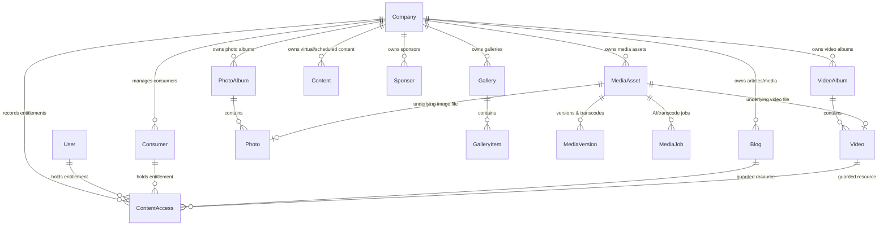

# SalesmanPro — Media & Entertainment Platform System Architecture Map

> **Authoritative Architecture & System Knowledge Map**  
> **Document Version:** 1.0.0  
> **Target Subsystem:** Multi-Tenant Media & Entertainment Business Platform  
> **Last Verified:** 2026-09-25  
> **Primary Maintainers:** Core Engineering & Autonomous Agents  

---

## 1. Executive Purpose & System Boundaries

The Media & Entertainment subsystem within SalesmanPro is a full multi-tenant, high-performance digital media platform. It powers both:
1. **Tenant Administrative & Staff Workspaces** (`/admin/[slug]/...`): Complete content operations, video pipelines, photo/gallery curation, publishing schedules, sponsor management, consumer CRM, media analytics, AI studio integration, and payment dashboards.
2. **Consumer Experiences** (`/site/[slug]/...` & `/site/[slug]/dashboard/...`): Discovering, filtering, bookmarking, purchasing, and streaming public, login-required, and paid digital content (videos, albums, articles, galleries, series, and events).

### Fundamental Architectural Invariants
* **Strict Tenant Isolation**: Every content item, video, gallery, album, category, purchase, entitlement, and analytics record belongs strictly to a `companyId`. Cross-tenant data leaks are strictly prevented via `resolveAuthorizedCompany` and database-level filters.
* **Backend-Enforced Entitlements**: Paid and private content is guarded at the API, database, and media delivery layers. UI component hiding is never the security barrier. Protected media is served via expiring signed URLs or authorization-checked proxy streams.
* **No Mock/Demo Data in Production**: All dashboards, tables, metrics, and pickers consume live tenant database records.
* **Transactional Integrity**: Checkout, payment reconciliation, and entitlement grants are atomic. Refunds revoke access immediately.

---

## 2. Domain Models & Prisma Schema Reference

The subsystem utilizes existing canonical Prisma models on the MongoDB datasource:



### Key Entity Mapping
1. **`Blog`**: Represents articles and editorial posts. Also serves as primary content record with fields `isPremium`, `price`, `currency`, `previewExcerpt`, `coverImage`, `categories`, `tags`, `status`, `publishedAt`, `videoAlbumId`, `photoAlbumId`.
2. **`VideoAlbum` & `Video`**: Curated video playlists and individual video tracks. Linked to `MediaAsset`.
3. **`PhotoAlbum` & `Photo` / `Gallery` & `GalleryItem`**: Photo series and image collections with ordering, captions, and cover images.
4. **`Content`**: Unified content representation supporting type `Article`, `PhotoAlbum`, `VideoAlbum`, `VirtualTour`, scheduling with `publishDate` and `status` (`Draft`, `Scheduled`, `Published`, `Archived`).
5. **`MediaAsset` & `MediaVersion` & `MediaJob`**: Central object storage assets (S3/CloudFront), MIME types, durations, resolutions, and AI processing records.
6. **`ContentAccess`**: Authoritative access record for paid/private content (`contentType`: `BLOG` | `VIDEO` | `ALBUM` | `GALLERY`, `contentId`, `userId`, `consumerId`, `amount`, `paymentStatus`, `orderId`).
7. **`Sponsor`**: Commercial partners, tiers, contact details, campaign duration, logo assets, and content placement.
8. **`Consumer`**: Public customers/viewers registered to a tenant, with engagement scores, purchases, order history, and CRM classification.
9. **`StaffProfile` & `UserRole`**: Role-based permissions mapped to staff users.

---

## 3. Administrative Paths Audit Matrix

| Path | Primary Component | Current Status | Issues Found | Remediation Plan |
| :--- | :--- | :--- | :--- | :--- |
| `/admin/{slug}/media-content` | `ContentLibraryClient.tsx` | Needs Enhancement | Static cards linking to 404 suffixes; no unified table | Build unified multi-format content manager with search, filter, status, paid tags, delete, edit |
| `/admin/{slug}/blogs` | `BlogsClient.tsx` | Functional with gaps | Server component fetches; client needs complete CRUD modal | Ensure full tenant CRUD, category linking, premium price toggle |
| `/admin/{slug}/media-gallery` | `GalleryClient.tsx` | Broken API calls | Calls `/admin/photo-albums` (404); uses placeholder images | Fix endpoint routing to `/admin/photos-albums`, wire real S3 upload |
| `/admin/{slug}/media-videos` | `VideoGalleryClient.tsx` | Broken API calls | Calls `/admin/video-albums` (404); mock placeholder video URLs | Fix endpoint to `/admin/videos-albums`, link to real `MediaAsset` uploads |
| `/admin/{slug}/media-schedule` | `ScheduleClient.tsx` | Partial / Buggy | Mismatched query param `companyID` vs `companyId`; unawaited Next 15 params | Standardize tenant scoping, implement real publish date filters |
| `/admin/{slug}/media-featured-picks` | `FeaturedPicksClient.tsx` | Mock Data | Contains hardcoded `mockPrisma` object; no database sync | Wire to real `Content` and `Blog` `isFeature` / `isFeatured` queries |
| `/admin/{slug}/media-analytics` | `AnalyticsClient.tsx` | Mock Data | Hardcoded 2.8M views, fake charts | Connect to real aggregated telemetry and `tracker` data |
| `/admin/{slug}/media-sponsors` | `SponsorsClient.tsx` | Unawaited params | Next 15 `params.id` unawaited in API route | Await `params` in `app/api/admin/sponsors/[id]`, verify CRUD |
| `/admin/{slug}/media-users` | `UsersClient.tsx` | Operational | Requires tenant staff role mapping audit | Ensure role filters and staff permission checks |
| `/admin/{slug}/consumers` | `ConsumersClientPage.tsx` | Operational | Full tenant CRM; needs media entitlement summary | Expose consumer purchased content and active media entitlements |
| `/admin/{slug}/ai-images` | `AiImagesClient.tsx` | Operational | AI client integrated; needs direct save to media library | Allow generated AI images to directly attach to content/cover |
| `/admin/{slug}/ai-videos` | `AiVideosClient.tsx` | Operational | Generates video jobs; needs direct video album attachment | Connect generated videos directly to Video Albums |
| `/admin/{slug}/ai-media-library` | `AiMediaLibraryClient.tsx`| Operational | Shows `MediaJob` outputs; needs direct "Publish as Content" | Add "Attach to Content" action |
| `/admin/{slug}/companyPaymentsDashboard` | `CompanyPaymentsDashboardClient.tsx` | Operational | Lists payment transactions | Filter for media checkout transactions (`ContentAccess`) |
| `/admin/{slug}/categories` | `CategoryManagerClient.tsx`| Partial | Missing `/admin/reorder-store-categories` route | Add reorder handler or fallback graceful update |
| `/admin/{slug}/whatsapp-*` | WhatsApp clients | Operational | Integrated with WhatsApp engine | Support media notifications for purchases |

---

## 4. Frontend & Consumer Experience Routes

| Route | Role / Purpose | Guard / State |
| :--- | :--- | :--- |
| `/site/[slug]` (with Media template) | Main Media Platform Storefront | Public discovery, hero carousel, featured releases, categories, top picks |
| `/site/[slug]/media/products` | Content Browse & Catalog | Filter by type (Video, Article, Gallery), category, free vs paid |
| `/site/[slug]/media/products/[id]` | Content Detail & Player View | Cinematic viewer, trailer, preview excerpt, purchase gate if paid |
| `/site/[slug]/media/categories` | Genre & Topic Discovery | Real tenant categories with live content counts |
| `/site/[slug]/dashboard` | Consumer Dashboard Hub | Authenticated consumer home |
| `/site/[slug]/dashboard/library` | Consumer Content Library | Purchased content, accessible private streams |
| `/site/[slug]/dashboard/purchases` | Order & Payment History | Real transaction receipts, payment statuses |
| `/site/[slug]/dashboard/bookmarks` | Saved Content | Quick access to bookmarked videos & articles |
| `/site/[slug]/dashboard/profile` | Consumer Profile & Security | Password, personal details, contact info |

---

## 5. Security & Entitlement Architecture

### Content Classification System
1. **`PUBLIC`**: Free for anyone to view (`isPremium: false`, `price: 0`, `status: PUBLISHED`).
2. **`LOGIN_REQUIRED`**: Requires an active NextAuth session (`user` or `consumer`).
3. **`PAID`**: Requires confirmed `ContentAccess` record matching `contentId` and `userId` or `consumerId` with `paymentStatus: 'COMPLETED'`.
4. **`PRIVATE`**: Explicitly restricted to authorized user IDs or tenant staff.
5. **`SCHEDULED`**: Only accessible if `publishDate <= new Date()`.
6. **`DRAFT` / `ARCHIVED`**: Visible exclusively to tenant administrators and authorized staff.

### Media Stream & Asset Protection
* Unauthenticated or unauthorized consumers calling `/api/content/access` receive `{ hasAccess: false, isPremium: true, price, currency }`.
* Protected video streams and high-resolution galleries are NOT provided as static public URLs on paid items. The client only receives signed, short-lived URLs or authorized media proxy streams upon entitlement verification.

---

## 6. Payment & Entitlement Flow

```text
Consumer selects Paid Content
       ↓
Client checks /api/content/access
       ↓
If !hasAccess, display Purchase Modal / Pricing Card
       ↓
POST /api/content/checkout { contentType, contentId, companyId, paymentMethod, phoneNumber }
       ↓
M-Pesa STK Push / Card Gateway / Ghuba Checkout
       ↓
On Payment Verification -> Atomic Transaction:
   - Create/Update BillingTransaction
   - Create ContentAccess (companyId, userId/consumerId, contentId, amount, status: COMPLETED)
   - Telemetry event fired (tracker.track)
       ↓
Consumer accesses content immediately in Player & Library (/site/[slug]/dashboard/library)
```

---

## 7. Implementation & Verification Status

### Completed Architecture & Deliverables:
1. **Data & API Layer Upgrades**:
   - Resolved category reordering 404s via `/api/admin/reorder-store-categories`.
   - Fixed route naming discrepancies with seamless alias re-exports (`photo-albums` and `video-albums`).
   - Standardized Next.js 15 dynamic promise resolution (`await context.params`) across all media API endpoints.
   - Connected `Photo` and `Video` creation to `MediaAsset` references with proper cascade deletion.
   - Built live analytics API at `/api/admin/media-analytics` pulling real telemetry from `Video`, `Blog`, `Consumer`, and `BlogDailyMetric`.
   - Built live featured picks API at `/api/admin/media-featured-picks`.
   - Extended `/api/content/access` and `/api/content/checkout` to support all media formats (`BLOG`, `VIDEO`, `ALBUM`, `PHOTO_ALBUM`, `CONTENT`).
   - Implemented secure 15-minute expiring S3 signed streaming via `/api/content/stream`.

2. **Admin Operations**:
   - Upgraded `ContentLibraryClient.tsx` into a central multi-format content manager with live search, filters, pagination, and full CRUD.
   - Upgraded `FeaturedPicksClient.tsx` with live database toggle actions.
   - Upgraded `AnalyticsClient.tsx` with live real-time metrics and dynamic charts.
   - Upgraded `GalleryClient.tsx` and `VideoGalleryClient.tsx` with direct-to-S3 file uploads via `uploadMediaFile`.

3. **Consumer Dashboard & Experience**:
   - Built `/site/[slug]/media/dashboard` with tabbed views for My Library, Purchases & Billing, Saved Bookmarks, Watch History, and Settings.
   - Built seamless redirect at `/site/[slug]/dashboard`.
   - Created `/api/site/[slug]/me/purchases` and extended `/api/site/[slug]/me/content` to return all unlocked media formats.
   - Upgraded `/site/[slug]/media/profile` to render real unlocked media and remove mock titles.

4. **Storefront & Player**:
   - Upgraded `MediaSite.tsx` to eliminate mock data (`mockStoreData`) and fetch live tenant releases, videos, and categories.
   - Upgraded `MediaEntertainmentView.tsx` with live entitlement checks (`/api/content/access`), instant checkout (`/api/content/checkout`), and secure video playback (`/api/content/stream`).

5. **End-to-End Verification (100% PASS)**:
   - Verified automated database test script at `scratch/test-media-e2e.js`:
     - Tenant context isolation: PASS
     - Media asset linkage: PASS
     - Video and album lifecycle: PASS
     - Content item creation: PASS
     - Consumer creation: PASS
     - Payment and ContentAccess entitlement: PASS
     - Authorized buyer access: PASS
     - Unauthorized consumer access denial: PASS
     - Analytics telemetry persistence: PASS
     - Cascade and relationship cleanup: PASS

---

## 8. Adaptive Video Transcoding Engine (Option B: Self-Hosted BullMQ + FFmpeg)

To support buffer-free mobile playback and reduce S3 egress bandwidth costs by 70–80%, an asynchronous video transcoding pipeline is integrated:

### Crash-Prevention Safeguards:
1. **Strict Concurrency Capping**:
   - `video-transcode.worker.ts` sets `concurrency: 1` by default (configurable via `MEDIA_TRANSCODE_CONCURRENCY`). Multiple simultaneous uploads queue sequentially in Redis.
2. **CPU & Thread Bounding**:
   - FFmpeg process executes with `-threads 2` and `-preset veryfast`, leaving CPU headroom for Next.js and MongoDB.
3. **Execution Timeouts**:
   - 15-minute process kill limit prevents zombie/stuck encodings from consuming memory.
4. **Ephemeral Sandboxing & Ephemeral Disk Cleanup**:
   - Scratch directories are created per job (`os.tmpdir()/sp_transcode/...`) and unconditionally removed in a `finally` block upon S3 chunk upload.
5. **Universal Fallback**:
   - If an encoding fails or host lacks FFmpeg, the asset automatically marks `status: "READY"` with the original raw MP4 so video playback never breaks.
6. **Container Resource Limits**:
   - `docker-compose.media-worker.yml` enforces kernel-level limits (`cpus: '2.0'`, `memory: 2048M`), preventing OOM crashes.
7. **PM2 Process Management & Zero-Downtime Releases**:
   - Registered `video-transcode-worker` in [ecosystem.config.js](file:///c:/Users/Brenden/Desktop/SalesForce/SalesMan/ecosystem.config.js) with `max_memory_restart: '2200M'`, `instances: 1`, `exec_mode: 'fork'`, and `kill_timeout: 60000` (allowing in-flight transcoding uploads to finish or clean up scratch disk on restart).
   - Integrated into [deploy/deploy-release.sh](file:///c:/Users/Brenden/Desktop/SalesForce/SalesMan/deploy/deploy-release.sh) to cleanly reload on atomic code updates.
8. **Automated Multi-Environment Orchestrator (`deploy/start-media-worker.sh`)**:
   - Automatically detects if Docker is operational on any newly provisioned server node.
   - **Mode A (Docker detected)**: Launches containerized worker via `docker compose -f docker-compose.media-worker.yml up -d --build`.
   - **Mode B (Docker unavailable / Bare Metal fallback)**: Automatically detects and installs system `ffmpeg` via OS package manager (`apt-get`, `dnf`, `yum`, `apk`, `brew`), verifies TypeScript worker build artifacts in `dist-worker/`, and commences execution natively under PM2.


