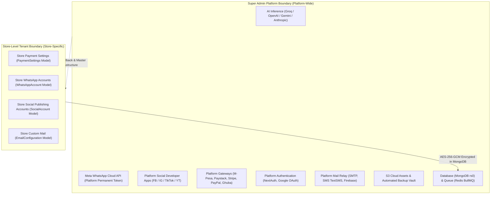

# SalesmanPro — Comprehensive Integration & Credential Inventory

> **Authoritative Technical Specification & Audit Register**  
> **Platform Version:** Next.js 15.1.11 | Node.js 20+ | MongoDB 7.0 (rs0) | Prisma 5.22  
> **Target Domains:** `salesmanpro.site` | `auth.salesmanpro.site`  
> **Production VPS Host:** Contabo VPS (`/var/www/salesmanpro`)  
> **Audit Date:** 2026-10-02  
> **Security Notice:** No plaintext secrets, tokens, or private credentials are included in this document. All credentials are cataloged by variable name, encryption type, status, and verification procedure.

---

## 1. Executive Summary & Inventory Register

This audit covers **26 external providers, services, SDKs, and infrastructure subsystems** required for the full operational capacity of SalesmanPro.

### Inventory Summary by Operational Status

| Status | Count | Integrations |
| :--- | :---: | :--- |
| **`CONFIGURED` / `VERIFICATION_REQUIRED`** | **19** | Groq, OpenAI, Google Gemini, Meta WhatsApp, Facebook Social, Instagram Social, YouTube Social, M-Pesa Daraja, Paystack, Stripe, PayPal, Ghuba, NextAuth, Google OAuth, Hostinger SMTP, TextSMS Kenya, Firebase FCM, AWS/Wasabi S3, MongoDB, Redis BullMQ, Master AES Ciphers |
| **`REGISTRATION_REQUIRED`** | **5** | Anthropic Claude, SerpApi, TikTok Content API, Resend, SendGrid |
| **`DISCOVERED` / Optional** | **2** | Cloudinary (legacy media fallback), Google Custom Search API |
| **Total Cataloged** | **26** | **100% of codebase references mapped** |

---

## 2. Platform Architecture & Credential Boundary

SalesmanPro operates a **two-tier multi-tenant credential model**:

1. **Super Admin Platform Credentials (`.env` & `shared/.env`)**:
   - Provide platform-wide shared services (AI credit engine, system WhatsApp notifications, platform payment processing, core OAuth, default SMTP, and S3 media storage).
2. **Store-Dependent Credentials (`PaymentSettings`, `WhatsAppAccount`, `SocialAccount`, `EmailConfiguration`)**:
   - Individual merchant accounts encrypted using `AES-256-GCM` (`MASTER_ENCRYPTION_KEY` / `BACKUP_ENCRYPTION_KEY`).
   - Tenant accounts never access Super Admin credentials directly.

---

## 3. Detailed Integration Inventory

---

### Category A: AI Infrastructure & Model Routing

#### 1. Groq Cloud Inference
* **Provider:** Groq Inc.
* **Service:** Groq LPU Ultra-Low Latency Inference (`llama-3.3-70b-versatile`)
* **Module:** WhatsApp AI Conversational Agent, Background Workforce Worker, SEO Generator
* **Scope:** Platform-Wide (Super Admin Managed)
* **Environment Variables:** `GROQ_API_KEY`, `GROQ_MODEL`
* **Credential Types:** API Key (gsk_...), Model String
* **Registration Portal:** [Groq Cloud Console](https://console.groq.com/keys)
* **Documentation:** [Groq API Documentation](https://console.groq.com/docs/quickstart)
* **Account Type:** Developer / Organization Account
* **Prerequisites:** Verified Email & Mobile Phone
* **Scopes / Permissions:** Inference API Access
* **Sandbox / Production:** Single endpoint; rate-limited by account tier
* **Billing / Domain Verif:** Credit Card billing required for high-throughput production tier
* **Local Status:** `CONFIGURED` / `VERIFICATION_REQUIRED`
* **Code References:**
  - `lib/whatsapp/ai/groqProvider.ts`
  - `lib/ai/superAdminService.ts`
  - `workers/ai-job-worker.ts`
  - `workers/ai-workforce-worker.ts`
* **Verification Procedure:** Execute `GET https://api.groq.com/openai/v1/models` with `Authorization: Bearer $GROQ_API_KEY`. Verify HTTP 200 and model presence.

#### 2. OpenAI API
* **Provider:** OpenAI
* **Service:** GPT-4o, GPT-4o-mini, Text-Embedding-3-Small, DALL-E 3
* **Module:** AI Fallback Engine, Multimodal Product Recognition, Vector Embeddings
* **Scope:** Platform-Wide (Super Admin Managed)
* **Environment Variables:** `OPENAI_API_KEY`, `OPENAI_MODEL`
* **Credential Types:** Secret API Key (sk-proj-...)
* **Registration Portal:** [OpenAI Developer Platform](https://platform.openai.com/api-keys)
* **Documentation:** [OpenAI API Reference](https://platform.openai.com/docs/api-reference)
* **Account Type:** Organization Account (Tier 1+)
* **Prerequisites:** Paid credit balance
* **Scopes / Permissions:** `model.read`, `model.request`
* **Sandbox / Production:** Shared endpoint with usage limits
* **Billing / Domain Verif:** Active billing account with positive pre-funded balance
* **Local Status:** `CONFIGURED` / `VERIFICATION_REQUIRED`
* **Code References:**
  - `lib/whatsapp/ai/openaiProvider.ts`
  - `lib/ai/superAdminService.ts`
  - `workers/ai-job-worker.ts`
* **Verification Procedure:** Query `GET https://api.openai.com/v1/models` using `Authorization: Bearer $OPENAI_API_KEY`. Check for `gpt-4o-mini` and `text-embedding-3-small`.

#### 3. Google Gemini
* **Provider:** Google Cloud Platform / Google AI Studio
* **Service:** Gemini 2.0 Flash / Pro, Multimodal Vision, Image Analysis
* **Module:** Visual Product Analysis, Barcode/Document Recognition, Super Admin AI
* **Scope:** Platform-Wide
* **Environment Variables:** `GEMINI_API_KEY`, `GOOGLE_GENAI_API_KEY`, `GOOGLE_GENERATIVE_AI_API_KEY`, `NEXT_PUBLIC_GEMINI_API_KEY`
* **Credential Types:** API Key (AIza...)
* **Registration Portal:** [Google AI Studio](https://aistudio.google.com/app/apikey)
* **Documentation:** [Google Gemini API Docs](https://ai.google.dev/gemini-api/docs)
* **Account Type:** Google Cloud Project with Generative Language API enabled
* **Prerequisites:** GCP Project linked to billing
* **Scopes / Permissions:** `generativelanguage.googleapis.com`
* **Sandbox / Production:** Shared endpoint with quota tiers
* **Billing / Domain Verif:** Pay-as-you-go billing recommended for production SLA
* **Local Status:** `CONFIGURED` / `VERIFICATION_REQUIRED`
* **Code References:**
  - `lib/ai/geminiClient.ts`
  - `lib/ai/superAdminService.ts`
  - `app/api/ai/route.ts`
* **Verification Procedure:** Issue `GET https://generativelanguage.googleapis.com/v1beta/models?key=$GEMINI_API_KEY`. Verify HTTP 200.

#### 4. Anthropic Claude (Optional / Roadmapped)
* **Provider:** Anthropic
* **Service:** Claude 3.5 Sonnet / Claude 3 Haiku
* **Module:** Complex Reasoning & Content Generation Fallback
* **Scope:** Platform-Wide
* **Environment Variables:** `ANTHROPIC_API_KEY`
* **Credential Types:** API Key (sk-ant-...)
* **Registration Portal:** [Anthropic Console](https://console.anthropic.com/settings/keys)
* **Documentation:** [Anthropic API Documentation](https://docs.anthropic.com/claude/reference/getting-started)
* **Account Type:** Anthropic Developer Workspace
* **Prerequisites:** Workspace with pre-funded balance
* **Local Status:** `REGISTRATION_REQUIRED`
* **Code References:** `lib/ai/superAdminService.ts`
* **Verification Procedure:** POST test ping to `https://api.anthropic.com/v1/messages` with headers `x-api-key: $ANTHROPIC_API_KEY` and `anthropic-version: 2023-06-01`.

#### 5. SerpApi & Google Search
* **Provider:** SerpApi / Google Custom Search
* **Service:** Real-time web search and competitor pricing intelligence
* **Module:** AI Workforce Competitor Analyst & Market Research Agent
* **Scope:** Platform-Wide
* **Environment Variables:** `SERPAPI_API_KEY`, `GOOGLE_SEARCH_API_KEY`, `GOOGLE_SEARCH_ENGINE_ID`
* **Credential Types:** API Keys
* **Registration Portal:** [SerpApi Dashboard](https://serpapi.com/manage-api-key)
* **Local Status:** `REGISTRATION_REQUIRED`
* **Code References:** `lib/ai/superAdminService.ts`
* **Verification Procedure:** Check account status endpoint via `GET https://serpapi.com/account?api_key=$SERPAPI_API_KEY`.

---

### Category B: Meta & WhatsApp Cloud API

#### 6. Meta WhatsApp Cloud API
* **Provider:** Meta Platforms Inc.
* **Service:** WhatsApp Business Platform (Cloud API)
* **Module:** Customer Conversations, Automated Ordering, STK Push Payment Prompts, Order Updates
* **Scope:** Hybrid (Super Admin Platform-Level Permanent System User + Tenant WABA Storefronts)
* **Environment Variables:**
  - `WHATSAPP_VERIFY_TOKEN`: Webhook challenge verification secret
  - `WHATSAPP_ACCESS_TOKEN`: Permanent System User Access Token (EAAB...)
  - `WHATSAPP_PHONE_NUMBER_ID`: Sending Phone Number Node ID
  - `WHATSAPP_BUSINESS_ACCOUNT_ID`: WhatsApp Business Account ID (WABA)
  - `WHATSAPP_APP_SECRET`: Meta App Secret for SHA-256 HMAC payload verification
  - `WHATSAPP_GRAPH_VERSION`: API Version (default: `v21.0`)
  - `WHATSAPP_GRAPH_BASE_URL`: `https://graph.facebook.com/v21.0`
  - `WHATSAPP_ALLOW_UNSIGNED_WEBHOOK`: Safety override (false in production)
* **Credential Types:** System User Bearer Token, Phone ID, WABA ID, App Secret
* **Registration Portal:** [Meta Developer Apps](https://developers.facebook.com/apps/)
* **Documentation:** [WhatsApp Cloud API Get Started](https://developers.facebook.com/docs/whatsapp/cloud-api/get-started)
* **Account Type:** Verified Meta Business Manager Account with WhatsApp Business Account (WABA)
* **Prerequisites:**
  1. Meta Business Verification (Official Business Documents)
  2. Permanent System User generated under Business Settings with Admin role
  3. Phone number not currently registered on personal WhatsApp app
* **Required Scopes:** `whatsapp_business_messaging`, `whatsapp_business_management`
* **Webhook Endpoints:**
  - Production: `https://salesmanpro.site/api/webhooks/whatsapp`
  - Health/Handshake: Handled via `GET` challenge response `hub.challenge`
* **Signature Verification:** Validated in `lib/whatsapp/webhook.ts` using `x-hub-signature-256` against `WHATSAPP_APP_SECRET`.
* **Sandbox / Production:** Development sandbox uses Meta Test Numbers; Production requires 100% verified Business Manager and live SIM.
* **Billing / Domain Verif:** Payment card added to Meta Business Account for conversation charges.
* **Local Status:** `CONFIGURED` / `VERIFICATION_REQUIRED`
* **Code References:**
  - `lib/whatsapp/credentials.ts`
  - `lib/whatsapp/metaClient.ts`
  - `lib/whatsapp/webhook.ts`
  - `app/api/webhooks/whatsapp/route.ts`
  - `workers/whatsapp-worker.ts`
* **Verification Procedure:** Query `GET https://graph.facebook.com/v21.0/{WHATSAPP_PHONE_NUMBER_ID}?fields=display_phone_number,verified_name,quality_rating` with Bearer `$WHATSAPP_ACCESS_TOKEN`. Confirm valid phone and ACTIVE status.

---

### Category C: Social Media Publishing & Marketing

#### 7. Facebook Graph API
* **Provider:** Meta Platforms Inc.
* **Service:** Facebook Pages API
* **Module:** Automated Social Posts, Product Sync, AI Brand Publishing
* **Scope:** Hybrid (Super Admin App Config `PlatformSocialAppConfig` + Store Token `SocialAccount`)
* **Environment Variables:** `FACEBOOK_CLIENT_ID`, `FACEBOOK_CLIENT_SECRET`, `META_APP_ID`, `META_APP_SECRET`
* **Credential Types:** App ID, App Secret
* **Registration Portal:** [Meta Developers](https://developers.facebook.com/apps/)
* **OAuth Callback:** `https://salesmanpro.site/api/social/callback/facebook`
* **Required Scopes:** `pages_show_list`, `pages_read_engagement`, `pages_manage_posts`
* **Local Status:** `CONFIGURED` / `VERIFICATION_REQUIRED`
* **Code References:** `lib/social/adapters/facebookAdapter.ts`
* **Verification Procedure:** Validate App Token via `GET https://graph.facebook.com/oauth/access_token?client_id={ID}&client_secret={SECRET}&grant_type=client_credentials`.

#### 8. Instagram Graph API
* **Provider:** Meta Platforms Inc.
* **Service:** Instagram for Business API
* **Module:** Feed Post Publishing, Reels, Carousels, Insights
* **Scope:** Hybrid (`PlatformSocialAppConfig` + `SocialAccount`)
* **Environment Variables:** `INSTAGRAM_CLIENT_ID`, `INSTAGRAM_CLIENT_SECRET`, `META_APP_ID`, `META_APP_SECRET`
* **Credential Types:** App ID, App Secret
* **OAuth Callback:** `https://salesmanpro.site/api/social/callback/instagram`
* **Required Scopes:** `instagram_basic`, `instagram_content_publish`, `instagram_manage_insights`
* **Local Status:** `CONFIGURED` / `VERIFICATION_REQUIRED`
* **Code References:** `lib/social/adapters/instagramAdapter.ts`
* **Verification Procedure:** Validate app token pairing against Meta Graph API.

#### 9. TikTok Content Posting API
* **Provider:** TikTok for Developers
* **Service:** TikTok Video Publishing API
* **Module:** AI Video / Short Clip Publishing
* **Scope:** Hybrid (`PlatformSocialAppConfig` + `SocialAccount`)
* **Environment Variables:** `TIKTOK_CLIENT_KEY`, `TIKTOK_CLIENT_SECRET`, `TIKTOK_APP_ID`, `TIKTOK_APP_SECRET`
* **Credential Types:** Client Key, Client Secret
* **Registration Portal:** [TikTok Developers](https://developers.tiktok.com/)
* **OAuth Callback:** `https://salesmanpro.site/api/social/callback/tiktok`
* **Required Scopes:** `user.info.basic`, `video.publish`, `video.upload`
* **Local Status:** `REGISTRATION_REQUIRED`
* **Code References:** `lib/social/adapters/tiktokAdapter.ts`
* **Verification Procedure:** Query token exchange endpoint with client credentials.

#### 10. YouTube Data API v3
* **Provider:** Google Cloud Platform
* **Service:** YouTube Video Upload & Channel Management
* **Module:** AI Product Showcases & Video Publishing
* **Scope:** Hybrid (`PlatformSocialAppConfig` + `SocialAccount`)
* **Environment Variables:** `YOUTUBE_CLIENT_ID`, `YOUTUBE_CLIENT_SECRET`, `GOOGLE_CLIENT_ID`, `GOOGLE_CLIENT_SECRET`
* **Credential Types:** OAuth 2.0 Web Client ID & Client Secret
* **Registration Portal:** [Google Cloud Console Credentials](https://console.cloud.google.com/apis/credentials)
* **OAuth Callback:** `https://salesmanpro.site/api/social/callback/youtube`
* **Required Scopes:** `https://www.googleapis.com/auth/youtube.upload`, `https://www.googleapis.com/auth/youtube.readonly`
* **Local Status:** `CONFIGURED` (inherited from Google OAuth) / `VERIFICATION_REQUIRED`
* **Code References:** `lib/social/adapters/youtubeAdapter.ts`
* **Verification Procedure:** Check Google Discovery document and validate client configuration.

---

### Category D: Payment Gateways & Financial Settlement

#### 11. Safaricom Daraja M-Pesa
* **Provider:** Safaricom PLC
* **Service:** Daraja 2.0 Lipa na M-Pesa Online (STK Push), C2B, B2C
* **Module:** Direct Store Payments, WhatsApp In-Chat Checkout, Subscription Renewals
* **Scope:** Platform-Wide (Super Admin Default) + Store-Level Tills (`PaymentSettings`)
* **Environment Variables:**
  - `MPESA_ENVIRONMENT`: `sandbox` | `live`
  - `MPESA_BASE_URL`: `https://sandbox.safaricom.co.ke` vs `https://api.safaricom.co.ke`
  - `MPESA_CONSUMER_KEY`: Application Consumer Key
  - `MPESA_CONSUMER_SECRET`: Application Consumer Secret
  - `MPESA_SHORTCODE`: Business Paybill or Till Number (Sandbox: 174379)
  - `MPESA_PASSKEY`: Online Passkey for STK password generation
  - `MPESA_CALLBACK_URL`: `https://salesmanpro.site/api/mpesa/callback`
  - `MPESA_USE_SANDBOX`: Boolean flag
  - `MPESA_WEBHOOK_SECRET`: HMAC signature secret
* **Credential Types:** Consumer Key, Consumer Secret, Passkey, Shortcode
* **Registration Portal:** [Safaricom Developer Portal](https://developer.safaricom.co.ke/)
* **Documentation:** [Daraja 2.0 API Docs](https://developer.safaricom.co.ke/docs)
* **Account Type:** Registered Daraja Developer Account; Production requires Safaricom Business Certificate & Static IP
* **Prerequisites:** Valid Kenya National ID / Business Registration, Approved Paybill/Till, Signed Go-Live request
* **Webhook Endpoints:**
  - `https://salesmanpro.site/api/mpesa/callback`
  - `https://salesmanpro.site/api/webhooks/mpesa`
* **Sandbox / Production:** Completely separate keys, endpoints, and shortcodes
* **Local Status:** `CONFIGURED` / `VERIFICATION_REQUIRED`
* **Code References:**
  - `lib/whatsapp/payments/mpesaCallbackHandler.ts`
  - `app/api/mpesa/callback/route.ts`
  - `app/api/webhooks/mpesa/route.ts`
* **Verification Procedure:** Call `GET {MPESA_BASE_URL}/oauth/v1/generate?grant_type=client_credentials` with HTTP Basic Auth (`MPESA_CONSUMER_KEY`:`MPESA_CONSUMER_SECRET`). Verify returned JWT access token and 3599s expiry.

#### 12. Paystack
* **Provider:** Paystack Payments Limited (Stripe)
* **Service:** African Multi-Currency Card & Bank Transfer Gateway
* **Module:** Store Checkout, Card Processing, Subscription Plans
* **Scope:** Platform-Wide + Store-Level
* **Environment Variables:**
  - `PAYSTACK_PUBLIC_KEY`: Client-side public key (`pk_test_...` / `pk_live_...`)
  - `PAYSTACK_SECRET_KEY` / `PAYSTACK_SECRET`: Server-side secret key (`sk_test_...` / `sk_live_...`)
  - `PAYSTACK_BASE_URL`: `https://api.paystack.co`
  - `PAYSTACK_CALLBACK_URL`: `https://salesmanpro.site/api/webhooks/paystack`
* **Credential Types:** Public Key, Secret Key
* **Registration Portal:** [Paystack Dashboard](https://dashboard.paystack.com/#/settings/developer)
* **Documentation:** [Paystack API Documentation](https://paystack.com/docs/api/)
* **Account Type:** Starter / Registered Business
* **Prerequisites:** Bank account verification, Business KYC
* **Webhook Endpoint:** `https://salesmanpro.site/api/webhooks/paystack`
* **Signature Verification:** Validated via HMAC-SHA512 header `x-paystack-signature` using `PAYSTACK_SECRET_KEY`.
* **Sandbox / Production:** Distinct `pk_test`/`sk_test` and `pk_live`/`sk_live` keys
* **Local Status:** `CONFIGURED` / `VERIFICATION_REQUIRED`
* **Code References:**
  - `app/api/webhooks/paystack/route.ts`
  - `app/api/payments/paystack/route.ts`
* **Verification Procedure:** Issue `GET https://api.paystack.co/balance` with `Authorization: Bearer $PAYSTACK_SECRET_KEY`. Verify HTTP 200.

#### 13. Stripe
* **Provider:** Stripe Inc.
* **Service:** Global Credit/Debit Card Checkout & Payment Intents
* **Module:** International Customer Checkout & Subscriptions
* **Scope:** Platform-Wide + Store-Level
* **Environment Variables:**
  - `STRIPE_PUBLISHABLE_KEY` / `STRIPE_PUBLIC_KEY`: Frontend public key
  - `STRIPE_SECRET_KEY` / `STRIPE_SECRET`: Backend secret key
  - `STRIPE_SIGNING_SECRET` / `STRIPE_WEBHOOK_SECRET`: Webhook signing secret (`whsec_...`)
  - `STRIPE_WEBHOOK_URL`: `https://salesmanpro.site/api/webhooks/stripe`
* **Credential Types:** Publishable Key, Secret Key, Webhook Signing Secret
* **Registration Portal:** [Stripe Dashboard API Keys](https://dashboard.stripe.com/apikeys)
* **Documentation:** [Stripe API Documentation](https://stripe.com/docs/api)
* **Account Type:** Verified Stripe Business Account
* **Prerequisites:** Bank Account & Tax ID Verification
* **Webhook Endpoint:** `https://salesmanpro.site/api/webhooks/stripe`
* **Signature Verification:** Validated using `stripe.webhooks.constructEvent()` against `STRIPE_SIGNING_SECRET`.
* **Sandbox / Production:** Explicit test keys (`pk_test_...`) and live keys (`pk_live_...`)
* **Local Status:** `CONFIGURED` / `VERIFICATION_REQUIRED`
* **Code References:**
  - `app/api/webhooks/stripe/route.ts`
  - `app/api/payments/stripe/route.ts`
* **Verification Procedure:** Query `GET https://api.stripe.com/v1/balance` with Bearer auth `$STRIPE_SECRET_KEY`. Verify HTTP 200.

#### 14. PayPal
* **Provider:** PayPal Holdings Inc.
* **Service:** PayPal REST Orders v2 & Capture
* **Module:** Global Wallet Checkout
* **Scope:** Platform-Wide
* **Environment Variables:**
  - `PAYPAL_CLIENT_ID`: App Client ID
  - `PAYPAL_SECRET`: App Secret
  - `PAYPAL_BASE_URL`: `https://api-m.sandbox.paypal.com` or `https://api-m.paypal.com`
  - `PAYPAL_WEBHOOK_ID`: Webhook verification ID
  - `PAYPAL_USE_SANDBOX`: Boolean flag
* **Credential Types:** Client ID, Secret, Webhook ID
* **Registration Portal:** [PayPal Developer Dashboard](https://developer.paypal.com/dashboard/applications)
* **Documentation:** [PayPal REST API](https://developer.paypal.com/api/rest/)
* **Account Type:** PayPal Business Account
* **Webhook Endpoint:** `https://salesmanpro.site/api/webhooks/paypal`
* **Sandbox / Production:** Sandbox and Live app profiles
* **Local Status:** `CONFIGURED` / `VERIFICATION_REQUIRED`
* **Code References:**
  - `app/api/webhooks/paypal/route.ts`
  - `app/api/payments/paypal/route.ts`
* **Verification Procedure:** Request OAuth2 token from `{PAYPAL_BASE_URL}/v1/oauth2/token` using `grant_type=client_credentials`.

#### 15. Ghuba Marketplace Payment & Settlement
* **Provider:** Ghuba Marketplace Platform
* **Service:** SalesmanPro Shared Payment Infrastructure & Multi-Store Split Settlement
* **Module:** Centralized Settlement, Store Payouts, Transaction Commission Ledger
* **Scope:** Platform-Wide Master Aggregator Gateway
* **Environment Variables:**
  - `GHUBA_MERCHANT_ID`: SalesmanPro Master Merchant ID
  - `GHUBA_API_KEY`: Secret Integration Key
  - `GHUBA_BASE_URL` / `GHUBA_ENDPOINT`: `https://api.ghuba.shop`
  - `GHUBA_CALLBACK_URL`: `https://salesmanpro.site/api/webhooks/ghuba`
* **Credential Types:** Merchant ID, API Key, Callback URL
* **Registration Portal:** [Ghuba Merchant Portal](https://ghuba.shop/merchant/api-settings)
* **Documentation:** Internal / Partner API Documentation
* **Account Type:** Master Platform Aggregator Account
* **Prerequisites:** KYC Verification and Multi-Tenant Settlement Agreement
* **Webhook Endpoint:** `https://salesmanpro.site/api/webhooks/ghuba`
* **Sandbox / Production:** Separate staging and live merchant environments
* **Local Status:** `CONFIGURED` / `VERIFICATION_REQUIRED`
* **Code References:**
  - `app/api/webhooks/ghuba/route.ts`
  - `app/api/ghuba/route.ts`
* **Verification Procedure:** Issue ping request to `{GHUBA_BASE_URL}/api/v1/merchant/status` with `x-api-key: $GHUBA_API_KEY`.

---

### Category E: Authentication & Identity Management

#### 16. NextAuth.js Internal Core
* **Provider:** SalesmanPro Internal
* **Service:** Multi-Role Session & JWT Authentication
* **Module:** Super Admin, Store Admin, Staff, Customer, Rider & Student Logins
* **Scope:** Platform-Wide
* **Environment Variables:**
  - `NEXTAUTH_SECRET`: Master session signing secret (HMAC-SHA256)
  - `AUTH_SECRET`: Secondary Auth.js secret
  - `NEXTAUTH_URL`: Canonical public URL (`https://salesmanpro.site`)
  - `NEXTAUTH_URL_INTERNAL`: Internal loopback URL (`http://127.0.0.1:3000`)
  - `AUTH_TRUST_HOST`: Host trust flag (`true`)
  - `JWT_SECRET`: Handover token signing key for Android & Desktop apps
* **Credential Types:** 32+ byte high-entropy cryptographic secrets
* **Local Status:** `CONFIGURED` / `VERIFICATION_REQUIRED`
* **Code References:**
  - `lib/verifyAuth.ts`
  - `app/api/auth/[...nextauth]/route.ts`
  - `middleware.ts`
* **Verification Procedure:** Check entropy (string length >= 32), verify token signing and signature verification functions.

#### 17. Google OAuth 2.0
* **Provider:** Google Identity Services
* **Service:** Google Sign-In & Single Sign-On (SSO)
* **Module:** Frictionless Storefront User Login & Admin Onboarding
* **Scope:** Platform-Wide
* **Environment Variables:** `GOOGLE_CLIENT_ID`, `GOOGLE_CLIENT_SECRET`
* **Credential Types:** OAuth 2.0 Client ID (`...apps.googleusercontent.com`), Client Secret (`GOCSPX-...`)
* **Registration Portal:** [Google Cloud Console Credentials](https://console.cloud.google.com/apis/credentials)
* **Documentation:** [Google Identity OpenID Connect](https://developers.google.com/identity/openid-connect/openid-connect)
* **Account Type:** Google Cloud Project with OAuth Consent Screen
* **Redirect URIs:**
  - `https://salesmanpro.site/api/auth/callback/google`
  - `https://auth.salesmanpro.site/api/auth/callback/google`
  - `http://localhost:3000/api/auth/callback/google`
* **Required Scopes:** `openid`, `email`, `profile`
* **Domain Verification:** `salesmanpro.site` verified in Google Search Console / GCP Domain Verification
* **Local Status:** `CONFIGURED` / `VERIFICATION_REQUIRED`
* **Code References:**
  - `app/api/auth/[...nextauth]/route.ts`
* **Verification Procedure:** Fetch `https://accounts.google.com/.well-known/openid-configuration` and validate client ID format.

---

### Category F: Communications, Email & SMS

#### 18. Platform SMTP Email Relay
* **Provider:** Hostinger / Custom SMTP Server
* **Service:** Transactional Email (Order Confirmations, Password Resets, Alerts)
* **Scope:** Platform Default Gateway
* **Environment Variables:**
  - `DEFAULT_EMAIL_PROVIDER`: `SMTP`
  - `SMTP_HOST`: `smtp.hostinger.com`
  - `SMTP_PORT`: `587` (or `465`)
  - `SMTP_SECURE`: `false` (STARTTLS)
  - `SMTP_USER`: `no-reply@salesmanpro.site`
  - `SMTP_PASS`: Mailbox password
  - `DEFAULT_FROM_NAME`: `"SalesmanPro"`
  - `DEFAULT_FROM_EMAIL`: `no-reply@salesmanpro.site`
  - `DEFAULT_REPLY_TO`: `support@salesmanpro.site`
  - `EMAIL_RECEIVER`: Inbound contact form recipient
* **Credential Types:** Hostname, Port, Username, Password
* **Registration Portal:** [Hostinger hPanel](https://hpanel.hostinger.com/)
* **Prerequisites:** Valid SPF, DKIM, DMARC DNS records for `salesmanpro.site`
* **Local Status:** `CONFIGURED` / `VERIFICATION_REQUIRED`
* **Code References:**
  - `service/mailService.ts`
  - `app/api/post-email/route.ts`
* **Verification Procedure:** Initialize Nodemailer transport and run `transporter.verify()`.

#### 19. Alternative Email APIs (Resend / SendGrid)
* **Provider:** Resend Technologies / Twilio SendGrid
* **Service:** Cloud Email Delivery APIs
* **Scope:** Platform-Wide Fallback
* **Environment Variables:** `RESEND_API_KEY`, `SENDGRID_API_KEY`
* **Credential Types:** API Keys
* **Registration Portals:** [Resend](https://resend.com/api-keys) | [SendGrid](https://app.sendgrid.com/settings/api_keys)
* **Local Status:** `REGISTRATION_REQUIRED`
* **Code References:** `service/mailService.ts`
* **Verification Procedure:** Query API key validation endpoints via HTTP GET.

#### 20. TextSMS Kenya
* **Provider:** TextSMS Kenya
* **Service:** Transactional SMS & OTP Verification
* **Module:** Two-Factor Auth, Order Delivery SMS, Driver Dispatch Alerts
* **Scope:** Platform-Wide Default
* **Environment Variables:**
  - `SMS_API_KEY`: API Key
  - `SMS_PARTNER_ID`: Partner Account ID
  - `SMS_SENDER_ID`: Approved Alphanumeric Sender ID
  - `SMS_BASE_URL`: `https://sms.textsms.co.ke/api/services`
* **Credential Types:** API Key, Partner ID, Sender ID
* **Registration Portal:** [TextSMS Kenya Portal](https://sms.textsms.co.ke/)
* **Prerequisites:** Approved Alphanumeric Sender ID registered with Communications Authority of Kenya (CAK)
* **Local Status:** `CONFIGURED` / `VERIFICATION_REQUIRED`
* **Code References:** `lib/sms/index.ts`
* **Verification Procedure:** Query balance endpoint at `{SMS_BASE_URL}/getbalance` using partnerID and apikey.

#### 21. Firebase Cloud Messaging (FCM)
* **Provider:** Google Firebase
* **Service:** Mobile Push Notifications (Android & Web Push)
* **Module:** Real-Time Order Alerts, POS Ringing, Background Notifications
* **Scope:** Platform-Wide
* **Environment Variables:**
  - `FIREBASE_CLIENT_API_KEY`
  - `FIREBASE_CLIENT_AUTH_DOMAIN`
  - `FIREBASE_CLIENT_PROJECT_ID`
  - `FIREBASE_CLIENT_STORAGE_BUCKET`
  - `FIREBASE_CLIENT_MESSAGING_SENDER_ID`
  - `FIREBASE_CLIENT_APP_ID`
* **Credential Types:** Firebase Client Config JSON Object
* **Registration Portal:** [Firebase Console](https://console.firebase.google.com/)
* **Prerequisites:** Web App registration, Android SHA-256 certificate fingerprint
* **Local Status:** `CONFIGURED` / `VERIFICATION_REQUIRED`
* **Code References:**
  - `lib/firebase.ts`
  - `lib/notification-device-service.ts`
* **Verification Procedure:** Validate project configuration against Firebase initialization API.

---

### Category G: Cloud Storage, CDN & Disaster Recovery

#### 22. S3 Object Storage & CloudFront Asset CDN
* **Provider:** AWS / Wasabi Cloud Storage / Cloudflare R2
* **Service:** Product Images, Media Uploads, HLS Transcoded Video, PDF Invoices
* **Scope:** Platform-Wide
* **Environment Variables:**
  - `AWS_ACCESS_KEY_ID` / `AACCESS_KEY_ID`: IAM Access Key
  - `AWS_SECRET_ACCESS_KEY` / `ASECRET_ACCESS_KEY`: IAM Secret Key
  - `AWS_REGION` / `AREGION`: S3 Bucket Region (e.g. `us-east-1`)
  - `AWS_BUCKET_NAME` / `AS3_BUCKET_NAME` / `S3_BUCKET_NAME`: Media Bucket Name
  - `NEXT_PUBLIC_CDN_URL`: Public CDN Endpoint (`https://cdn.salesmanpro.site`)
* **Credential Types:** IAM Access Key, Secret Key, Bucket Name, Region
* **Registration Portal:** [AWS Console IAM](https://console.aws.amazon.com/iam/)
* **Prerequisites:** Least-privilege IAM policy (`s3:PutObject`, `s3:GetObject`, `s3:DeleteObject`, `s3:ListBucket`), CORS configuration
* **Local Status:** `CONFIGURED` / `VERIFICATION_REQUIRED`
* **Code References:**
  - `lib/s3.ts`
  - `app/api/upload-url/route.ts`
  - `workers/video-transcode-runner.ts`
* **Verification Procedure:** Execute `HeadBucketCommand` and `PutObjectCommand` with a temporary 0-byte verification probe, then delete it.

#### 23. Disaster Recovery & Automated Database Backup Vault
* **Provider:** Isolated S3 Storage (Wasabi / AWS / Cloudflare R2)
* **Service:** Encrypted Hourly, Daily, Weekly, Monthly MongoDB Backups
* **Scope:** Platform-Wide
* **Environment Variables:**
  - `BACKUP_STORAGE_PROVIDER`: `s3`
  - `BACKUP_S3_BUCKET`: `salesmanpro-production-backups`
  - `BACKUP_S3_REGION`: `us-east-1`
  - `BACKUP_S3_PREFIX`: `backups/production/mongodb`
  - `BACKUP_S3_ACCESS_KEY`: Backup IAM User Key
  - `BACKUP_S3_SECRET_KEY`: Backup IAM User Secret
  - `BACKUP_S3_ENDPOINT`: Optional R2/Wasabi endpoint
  - `BACKUP_ENCRYPTION_KEY`: 32-byte secret for AES-256-GCM backup artifact encryption
  - `BACKUP_ENCRYPTION_KEY_VERSION`: `v1`
  - `BACKUP_SECRET` / `BACKUP_CRON_SECRET`: Auth secret for cron trigger endpoints
  - `BACKUP_ALERT_EMAIL`: Alert recipient
* **Credential Types:** Dedicated S3 Credentials, AES-GCM Key
* **Local Status:** `CONFIGURED` / `VERIFICATION_REQUIRED`
* **Code References:**
  - `lib/crypto.ts`
  - `lib/verifyBackupSecret.ts`
  - `workers/backup-worker.ts`
* **Verification Procedure:** Check S3 bucket connectivity and test AES-256-GCM cipher round-trip on backup encryption key.

---

### Category H: Core Infrastructure, Database & Security

#### 24. MongoDB 7.0 Replica Set (`rs0`)
* **Provider:** MongoDB Inc. / Self-Hosted VPS
* **Service:** Primary Relational & Document Data Store with ACID Transactions
* **Scope:** Platform-Wide
* **Environment Variables:** `DATABASE_URL`
* **Credential Types:** MongoDB Connection String (`mongodb://...`)
* **Local Status:** `CONFIGURED` / `VERIFICATION_REQUIRED`
* **Code References:**
  - `prisma/schema.prisma`
  - `server/db/prismadb.ts`
* **Verification Procedure:** Execute `prisma.$runCommandRaw({ ping: 1 })` and verify replica set `rs0` status.

#### 25. Redis 6+ & BullMQ
* **Provider:** Redis / Self-Hosted VPS
* **Service:** High-Performance In-Memory Cache, Pub/Sub, Background Queues
* **Scope:** Platform-Wide
* **Environment Variables:** `REDIS_URL`
* **Credential Types:** Redis Connection URI (`redis://127.0.0.1:6379`)
* **Local Status:** `CONFIGURED` / `VERIFICATION_REQUIRED`
* **Code References:**
  - `lib/redis.ts`
  - `workers/*.ts` (all background queue workers)
* **Verification Procedure:** Issue Redis `PING` via `ioredis` and receive `PONG`.

#### 26. Master AES-256-GCM Encryption Key
* **Provider:** SalesmanPro Security Architecture
* **Service:** Cryptographic Encryption-at-Rest for Tenant Secrets
* **Scope:** Platform Security Root
* **Environment Variables:** `ENCRYPTION_KEY`, `MASTER_ENCRYPTION_KEY`, `BACKUP_ENCRYPTION_KEY`
* **Credential Types:** 32-byte (64 hex characters or 32 ASCII characters) cryptographic key
* **Local Status:** `CONFIGURED` / `VERIFICATION_REQUIRED`
* **Code References:**
  - `lib/crypto/aes.ts`
  - `lib/crypto.ts`
  - `lib/social/socialCrypto.ts`
* **Verification Procedure:** Test vector cipher execution with authentication tag validation.

---

## 4. Code Gaps & Optimization Recommendations

1. **Environment Variable Normalization**:
   - The codebase currently references both `AWS_ACCESS_KEY_ID` and `AACCESS_KEY_ID` as legacy fallbacks. A unified config loader should normalize these.
   - `PAYSTACK_SECRET_KEY` and `PAYSTACK_SECRET` are used interchangeably across two routes.
   - `STRIPE_SECRET_KEY` and `STRIPE_SECRET` are similarly duplicated in legacy handlers.
2. **Missing Provider Credentials in Local Environment**:
   - `ANTHROPIC_API_KEY`: Referenced in Super Admin AI router, awaiting API key generation.
   - `TIKTOK_CLIENT_KEY` / `TIKTOK_CLIENT_SECRET`: Defined in TikTok adapter, awaiting developer app review.
   - `RESEND_API_KEY`: Defined in mail router as alternative to SMTP.
3. **Security Invariant**:
   - The Super Admin encryption key (`ENCRYPTION_KEY` / `MASTER_ENCRYPTION_KEY`) must NEVER be rotated without running a database migration script to re-encrypt existing `PaymentSettings`, `WhatsAppAccount`, and `SocialAccount` records.

---

## 5. Next Steps for Super Admin Activation

1. **Phase 3 (Milestone 2)**: Install and configure Playwright in `lib/automation/playwright/` with supervised user-assisted authentication.
2. **Phase 4**: Implement secure local credential vault and `.env` manager with atomic file updates and secret redaction.
3. **Phase 5**: Build automated functional verification health-check scripts for all 19 configured integrations.
4. **Phase 6**: Integrate with the Super Admin dashboard at `/super-admin/integrations`.
5. **Phase 7 & 8**: Run local verification suite and prepare gated production deployment manifest.
