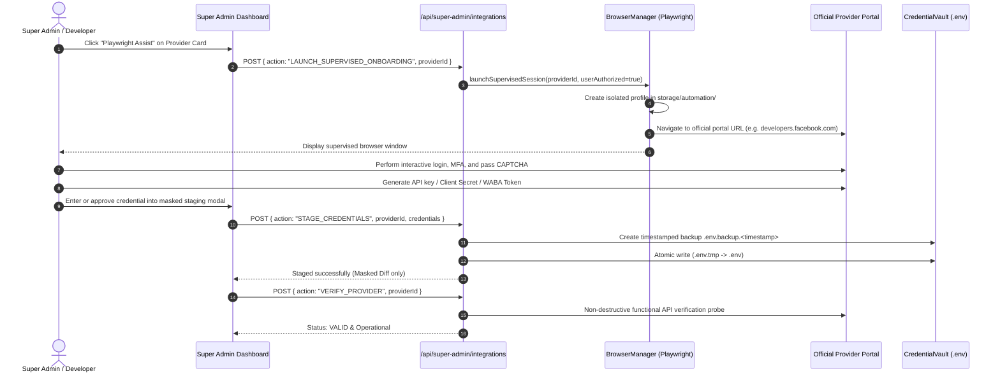

# SalesmanPro — Playwright-Assisted Provider Onboarding Engine

> **Document Type:** Operational & Architecture Specification  
> **Target Audience:** Super Admin, Lead DevOps Engineer, Application Security Architect  
> **Automation Engine:** Playwright Core with Isolated Profile Lifecycle  
> **Repository Module:** `lib/automation/playwright/`  

---

## 1. Architectural Philosophy

External provider portals (Meta Developer Center, Safaricom Daraja, Stripe Dashboard, Google Cloud Console, Groq Cloud) enforce strict security barriers:
- Multi-factor authentication (MFA / 2FA SMS & Authenticator apps)
- CAPTCHA and Cloudflare challenges
- Legal agreements, terms acceptance, and billing authorization
- Complex permission consent dialogs

**Core Principle:** The automation agent **assists and guides** rather than blindly scraping or attempting to bypass security challenges.
- **Zero Account Hijacking:** Never inspects or reuses the developer's personal browser profile or saved passwords.
- **Dedicated Sandbox Profile:** Launches an isolated Chromium instance inside `storage/automation/browser-profiles/{providerId}`.
- **Anti-Tamper Domain Guard:** Navigation is strictly restricted to an authorized domain allowlist (`developers.facebook.com`, `console.groq.com`, `dashboard.stripe.com`, etc.).
- **Human-in-the-Loop:** Pauses automatically for sensitive approvals, 2FA codes, and billing authorizations.
- **Zero-Leakage Credential Handover:** Captured credentials pass through an encrypted local channel directly into the credential vault without appearing in chat prompts, logs, or screenshots.

---

## 2. Onboarding Workflow Execution Diagram

---

## 3. Provider-Specific Onboarding Modules

The engine includes modular adapters in `lib/automation/playwright/adapters/`:

### A. Meta WhatsApp Cloud API (`metaWhatsappAdapter.ts`)
1. **Launch:** Opens `https://developers.facebook.com/apps/`.
2. **User Authentication:** Developer completes Facebook 2FA.
3. **App Selection:** Navigates to target business app -> WhatsApp -> API Setup.
4. **Webhook Setup:** Sets Callback URL `https://salesmanpro.site/api/webhooks/whatsapp` with Verify Token.
5. **System User Generation:** Directs to Meta Business Settings -> System Users -> Generate Permanent Access Token with `whatsapp_business_messaging` and `whatsapp_business_management`.
6. **Verification:** Validates Phone Number ID and WABA token against `graph.facebook.com/v21.0/{phone_id}`.

### B. Safaricom Daraja M-Pesa (`mpesaAdapter.ts`)
1. **Launch:** Opens `https://developer.safaricom.co.ke/`.
2. **Interactive Login:** Developer authenticates with Safaricom credentials.
3. **App Creation / Inspection:** Opens My Applications -> Lipa na M-Pesa Sandbox.
4. **Key Capture:** Retrieves `MPESA_CONSUMER_KEY` and `MPESA_CONSUMER_SECRET`.
5. **Verification:** Generates OAuth Bearer token against `{MPESA_BASE_URL}/oauth/v1/generate?grant_type=client_credentials`.

### C. Groq Cloud (`groqAdapter.ts`)
1. **Launch:** Opens `https://console.groq.com/keys`.
2. **Key Creation:** Developer generates "SalesmanPro Production" key.
3. **Verification:** Queries `https://api.groq.com/openai/v1/models` and confirms `llama-3.3-70b-versatile` availability.

### D. OpenAI Platform (`openAiAdapter.ts`)
1. **Launch:** Opens `https://platform.openai.com/api-keys`.
2. **Key Generation:** Developer creates Restricted or Project Key.
3. **Verification:** Queries `https://api.openai.com/v1/models` to confirm GPT-4o access.

### E. Google Gemini (`googleGeminiAdapter.ts`)
1. **Launch:** Opens `https://aistudio.google.com/app/apikey`.
2. **Key Generation:** Creates API key linked to SalesmanPro Google Cloud project.
3. **Verification:** Queries `https://generativelanguage.googleapis.com/v1beta/models?key={KEY}`.

### F. Stripe Global Payments (`stripeAdapter.ts`)
1. **Launch:** Opens `https://dashboard.stripe.com/apikeys`.
2. **Keys & Webhooks:** Developer retrieves Secret Key and configures webhook `https://salesmanpro.site/api/webhooks/stripe`.
3. **Verification:** Issues non-financial balance check `https://api.stripe.com/v1/balance`.

### G. Paystack (`paystackAdapter.ts`)
1. **Launch:** Opens `https://dashboard.paystack.com/#/settings/developer`.
2. **Key Capture:** Retrieves Secret Key (`sk_live_...` or `sk_test_...`).
3. **Verification:** Issues balance check `https://api.paystack.co/balance`.

### H. AWS / Wasabi S3 Storage (`s3Adapter.ts`)
1. **Launch:** Opens IAM Console.
2. **Service User:** Creates dedicated user with least-privilege policy (`PutObject`, `GetObject`, `DeleteObject`, `ListBucket`).
3. **Verification:** Executes `HeadBucketCommand` and safe 0-byte verification probe.

### I. SMTP Relay Gateway (`smtpAdapter.ts`)
1. **Launch:** Opens Hostinger hPanel or target mail server.
2. **Verification:** Nodemailer transport handshake (`transporter.verify()`) without sending outbound emails.

---

## 4. Security & Safety Checklist

- [x] Chromium profile isolated under `storage/automation/browser-profiles/`
- [x] URL navigation guard blocks all external unapproved domains
- [x] Passwords and 2FA entered directly by human, never intercepted
- [x] No plaintext secrets written to browser automation logs
- [x] Automated screenshotting disabled on credential input fields
- [x] Explicit Super Admin authorization required before browser launch
