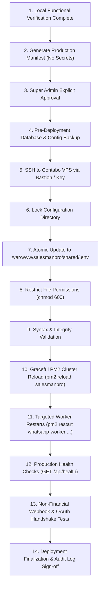

# SalesmanPro — Production Credential Deployment & Release Protocol

> **Target Host:** Contabo VPS (Ubuntu Linux, Node.js 20+, MongoDB 7.0, Redis 6+, PM2)  
> **Application Path:** `/var/www/salesmanpro/current`  
> **Shared Environment Path:** `/var/www/salesmanpro/shared/.env`  
> **Authoritative Deployment Policy:** Gated Super Admin Approval with Automated Backup & Rollback  

---

## 1. Production Architecture & Invariants

On the Contabo VPS, SalesmanPro runs under **PM2 Process Management** (`ecosystem.config.js`):
1. `salesmanpro` (Next.js Standalone Cluster — 2 instances, port 3000)
2. `whatsapp-worker` (BullMQ WhatsApp inbound message and AI responder worker)
3. `ai-job-worker` (BullMQ long-running AI generation queue)
4. `ai-workforce-worker` (Autonomous agent scheduled tasks)
5. `backup-worker` (Hourly/daily encrypted MongoDB disaster recovery runner)
6. `domain-ssl-worker` (Nginx tenant custom domain and Let's Encrypt SSL manager)
7. `observability-worker` (System health, error monitoring, and telemetry)
8. `video-transcode-worker` (FFmpeg media transcoding queue)

### Key Security Invariant:
**Never blindly copy the local `.env` file to production.**  
Production environment variables use:
- Separate live credentials (e.g. `MPESA_ENVIRONMENT=live`, `sk_live_...`, `pk_live_...`).
- Production webhook URLs (`https://salesmanpro.site/api/webhooks/...`).
- Distinct production database connection string and replica set options.
- The shared master configuration file is located at `/var/www/salesmanpro/shared/.env` and inherited by all releases and background workers.

---

## 2. Gated 14-Step Production Deployment Procedure



### Step-by-Step Instructions:

#### Step 1: Confirm Local Verification
Run the functional health checks locally to ensure all code changes pass:
```bash
npx ts-node -r ./scripts/register-paths.js --project tsconfig.worker.json scripts/run-integration-healthchecks.ts
```

#### Step 2: Generate Configuration Manifest
Confirm the list of variables to deploy without exposing their values.

#### Step 3: Super Admin Sign-off
Obtain explicit written authorization from the lead administrator before modifying server configuration.

#### Step 4: Secure Server-Side Backup
Before making any updates on the server, create a timestamped backup:
```bash
ssh user@vps_ip
cd /var/www/salesmanpro
cp shared/.env shared/.env.backup.$(date +%Y%m%d_%H%M%S)
chmod 600 shared/.env.backup.*
```

#### Step 5: Stage Approved Production Credentials
Apply approved variables using atomic file updates:
```bash
cat << 'EOF' > shared/.env.tmp
# Insert validated production configuration
EOF
mv shared/.env.tmp shared/.env
chmod 600 shared/.env
```

#### Step 6: Validate Syntax
Verify that the file is well-formed:
```bash
node -e "require('dotenv').config({ path: '/var/www/salesmanpro/shared/.env' }); console.log('Parsed successfully. Keys:', Object.keys(process.env).length);"
```

#### Step 7: Graceful Service Reload
**Do NOT run `pm2 restart all` blindly.**  
Reload the web cluster without dropping connections:
```bash
pm2 reload salesmanpro
```
Restart background workers sequentially:
```bash
pm2 restart whatsapp-worker
pm2 restart ai-job-worker
pm2 restart ai-workforce-worker
pm2 restart backup-worker
```

#### Step 8: Production Verification
1. Test primary web endpoint: `curl -I https://salesmanpro.site/`
2. Test healthcheck endpoint: `curl https://salesmanpro.site/api/health`
3. Test WhatsApp webhook handshake: Verify `hub.challenge` returns HTTP 200.
4. Verify PM2 logs for startup errors:
   ```bash
   pm2 logs --lines 50
   ```

---

## 3. Rollback & Disaster Recovery Protocol

If any production health check fails or elevated error rates are detected:

### Step 1: Immediate Stop
Halt further changes. Do not attempt unverified trial-and-error edits on production.

### Step 2: Restore Previous Known-Good Backup
```bash
cd /var/www/salesmanpro/shared
LATEST_BACKUP=$(ls -t .env.backup.* | head -n 1)
cp "$LATEST_BACKUP" .env
chmod 600 .env
```

### Step 3: Reload Services with Restored Configuration
```bash
pm2 reload salesmanpro
pm2 restart whatsapp-worker
pm2 restart ai-job-worker
```

### Step 4: Verify System Recovery
Verify that the application recovers to healthy status and that error rates drop to baseline.

### Step 5: Incident Post-Mortem
Examine sanitized error logs in `/var/www/salesmanpro/current/storage/logs/` or via PM2 to diagnose root cause before attempting redeployment.
