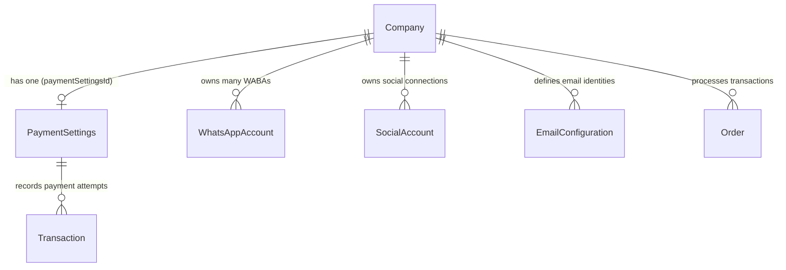
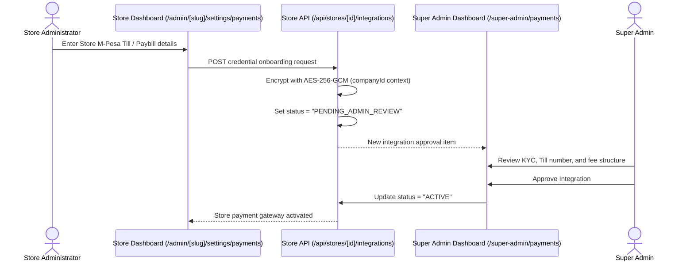

# SalesmanPro — Multi-Tenant Credential & Store-Dependent Architecture

> **Architecture Status:** Proposed / Future Phase Architecture Review  
> **Target Subsystems:** Tenant Storefronts, Ghuba Marketplace Split Gateway, Merchant Payment Accounts, Store WhatsApp WABAs  
> **Security Boundary:** Tenant Isolation with Super Admin Root Oversight  

---

## 1. Architectural Scope & Objectives

SalesmanPro is a multi-tenant platform powering independent merchants, e-commerce storefronts, schools, medical facilities, and delivery fleets.

While the **Super Admin** maintains platform-level infrastructure (default payment gateways, AI model routing, primary SMTP relay, and platform WhatsApp sender), individual stores require the capability to:
1. Connect their own **store-specific payment accounts** (direct M-Pesa Till/Paybill, Paystack subaccounts, Stripe Connect accounts).
2. Transact through **Ghuba Marketplace shared infrastructure** with platform fee deductions and automated reconciliation.
3. Connect store-branded **WhatsApp Business Accounts (WABA)** for dedicated customer communications.
4. Link store-owned **Social Media publishing accounts** (Facebook Pages, Instagram Business profiles, TikTok accounts, YouTube channels).
5. Configure custom **SMTP/Email identities** (e.g. `orders@mybrand.com`).

**Core Security Invariant:** Store administrators must **never** gain access to platform-level secrets or another merchant's credentials. All store-owned secrets must be encrypted at rest using `AES-256-GCM` and isolated by `companyId`.

---

## 2. Existing Schema Analysis & Foundation

The SalesmanPro Prisma schema already establishes foundational models for store-level integrations:



### Key Models Already Implemented in Prisma:
1. **`PaymentSettings`**:
   - Holds flags: `isStripeEnabled`, `isPaypalEnabled`, `isMpesaEnabled`, `isPaystackEnabled`, `isGhubaEnabled`.
   - Encrypted columns: `mpesaSecret_encrypted`, `paystackSecret_encrypted`, `stripeSecret_encrypted`, `paypalSecret_encrypted`, `ghubaSecret_encrypted`.
2. **`WhatsAppAccount`**:
   - Holds store-specific `phoneNumberId`, `businessAccountId`, `accessTokenEncrypted`, `appSecretEncrypted`, `webhookVerifyTokenEncrypted`.
3. **`SocialAccount`**:
   - Holds `platform` (`FACEBOOK`, `INSTAGRAM`, `TIKTOK`, `YOUTUBE`), `accessTokenEncrypted`, `refreshTokenEncrypted`, `scopes`, `status`.
4. **`EmailConfiguration`**:
   - Holds `scope` (`PLATFORM` | `GHUBA` | `STORE`), `host`, `port`, `usernameEncrypted`, `passwordEncrypted`, `apiKeyEncrypted`.

---

## 3. Ghuba Marketplace Payment & Settlement Architecture

The Ghuba integration represents a **hybrid platform-aggregator model**:

```text
[ Customer Checkout on Storefront ]
               ↓
[ Payment Gateway Option Selected: "Ghuba Checkout" ]
               ↓
[ Transaction Processed via SalesmanPro Platform Infrastructure ]
               ↓
[ Platform Fee Deducted (e.g. 2.5% Platform + Merchant Split) ]
               ↓
[ Merchant Net Amount Credited to Store Settlement Ledger ]
               ↓
[ Super Admin Approval Workflow -> Payout Disbursement to Merchant Till/Bank ]
```

### Architectural Distinctions:
1. **SalesmanPro Platform Infrastructure:**
   - The root engine executing checkout routes (`/api/webhooks/ghuba`, `/api/ghuba/route.ts`).
2. **Ghuba Platform-Level Credentials:**
   - `GHUBA_MERCHANT_ID`, `GHUBA_API_KEY`, `GHUBA_BASE_URL`. Owned exclusively by the Super Admin in the platform vault.
3. **Individual Store-Owned Accounts:**
   - Stores that have independent Ghuba merchant accounts configure their `ghubaMerchantId` inside `PaymentSettings`.
4. **Platform Fees & Settlement Ledger:**
   - Recorded in database transactions, displaying gross amount, platform fee, gateway fee, and merchant net balance.
5. **Super Admin Approval Workflows:**
   - Merchant payout requests trigger approval items inside `/super-admin/payments` (`SuperAdminPaymentsClient.tsx`).

---

## 4. Tenant Onboarding & Approval Lifecycle (Future Phase)

In the upcoming tenant phase, store admins will request integrations through a secure workflow:



---

## 5. Security & Isolation Invariants for Tenant Credentials

1. **Envelope Encryption & Key Derivation:**
   - Tenant secrets are encrypted using `AES-256-GCM`.
   - The initialization vector (`iv`) and authentication tag (`tag`) are stored alongside the ciphertext.
2. **Access Control Enforcement:**
   - API routes fetching store credentials must enforce `companyId` ownership (`user.companyId === targetCompanyId`).
   - Plaintext credentials are **never** returned in API responses. The store settings UI displays only masked values (e.g. `Paybill: 174379`, `Key: ***[CONFIGURED]***`).
3. **Webhook Tenant Resolution:**
   - Inbound payment webhooks resolve the tenant via metadata payload (`order.companyId` or `metadata.storeId`).
   - Signature validation uses the store-specific secret if configured, falling back to the platform secret.
4. **Zero Cross-Contamination:**
   - A compromised store secret cannot affect other stores or the Super Admin platform.

---

## 6. Staged Implementation Roadmap

- **Phase A (Current Complete):** Super Admin platform-level integration discovery, Playwright onboarding engine, local vault, and health checks.
- **Phase B (Next):** Implement the Store Integration Request modal in the tenant dashboard (`/admin/[slug]/settings/payments`).
- **Phase C:** Wire the Super Admin approval queue into `/super-admin/payments` for reviewing merchant-submitted payment accounts.
- **Phase D:** Automated merchant settlement and automated M-Pesa B2C payout integration.
