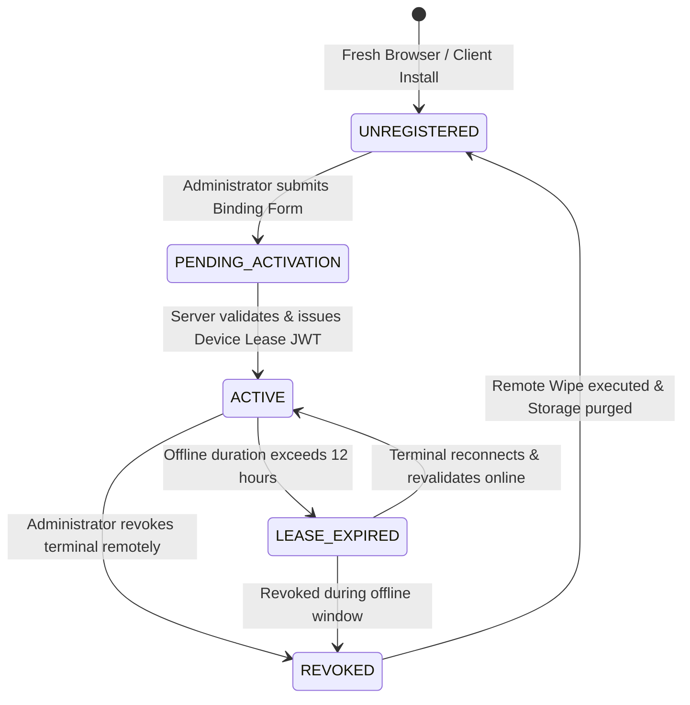

# SalesmanPro — Offline Device Lifecycle & Multi-Terminal Model

> **Document Version:** 1.0.0  
> **Status:** Authoritative Terminal Specification  
> **Target Subsystems:** Terminal Management, Receipt Sequence, Storage Persistence  

---

## 1. Terminal Lifecycle State Machine



---

## 2. Multi-Terminal Store Topology

A typical SalesmanPro storefront operates multiple checkout lanes simultaneously:

```text
                               STORE: "NAIROBI CENTRAL"
                                          │
            ┌─────────────────────────────┼─────────────────────────────┐
            ▼                             ▼                             ▼
       LANE 1 (T01)                  LANE 2 (T02)                  LANE 3 (T03)
┌─────────────────────────┐   ┌─────────────────────────┐   ┌─────────────────────────┐
│ DeviceId: DEV-NAI-01    │   │ DeviceId: DEV-NAI-02    │   │ DeviceId: DEV-NAI-03    │
│ Cashier: Alice          │   │ Cashier: Bob            │   │ Cashier: Carol          │
│ Offline Receipt Stream: │   │ Offline Receipt Stream: │   │ Offline Receipt Stream: │
│ RCP-T01-20260925-0001   │   │ RCP-T02-20260925-0001   │   │ RCP-T03-20260925-0001   │
│ RCP-T01-20260925-0002   │   │ RCP-T02-20260925-0002   │   │ RCP-T03-20260925-0002   │
│ Local Operational DB    │   │ Local Operational DB    │   │ Local Operational DB    │
└─────────────────────────┘   └─────────────────────────┘   └─────────────────────────┘
```

### Non-Colliding Offline Receipt Numbering

To guarantee zero receipt number collisions across multiple offline registers without central coordination, numbers follow a strict deterministic format:

$$\text{ReceiptNumber} = \text{RCP}-\langle\text{TerminalCode}\rangle-\langle\text{YYYYMMDD}\rangle-\langle\text{LocalSequence}\rangle$$

* **Example:** `RCP-T01-20260925-0042`
* **Local Sequence Counter:** An atomic counter in IndexedDB incremented inside the order creation transaction.
* **Daily Rollover:** When the local date changes, the sequence resets to `0001`.
* **Global Uniqueness Guarantee:** Because each terminal has a distinct store-assigned code (`T01`, `T02`, `T03`), collisions between lanes are mathematically impossible even if all terminals are offline for days.

---

## 3. Storage Quota & Eviction Protection

Mobile operating systems and desktop browsers may evict IndexedDB storage if disk space is low unless explicit durability is granted:

```typescript
// Enforce persistent storage quota protection in Web/PWA
if (navigator.storage && navigator.storage.persist) {
  const isPersisted = await navigator.storage.persist();
  console.log(`[STORAGE] Persistent storage granted: ${isPersisted}`);
}
```

### Data Retention & Pruning Rules

1. **Unsynced Transactions:** **NEVER PRUNED.** Unsynced journal entries and offline orders remain in IndexedDB indefinitely until acknowledged by the server.
2. **Synced Orders & Receipts:** Retained for **7 days** locally to enable offline receipt reprinting and shift returns. Automatically pruned on the 8th day during routine housekeeping.
3. **Product Catalog:** Pruned only via server tombstone instructions (`action: "DELETE"` in delta sync).
4. **Offline Audit Logs:** Synced logs pruned after **14 days**.
