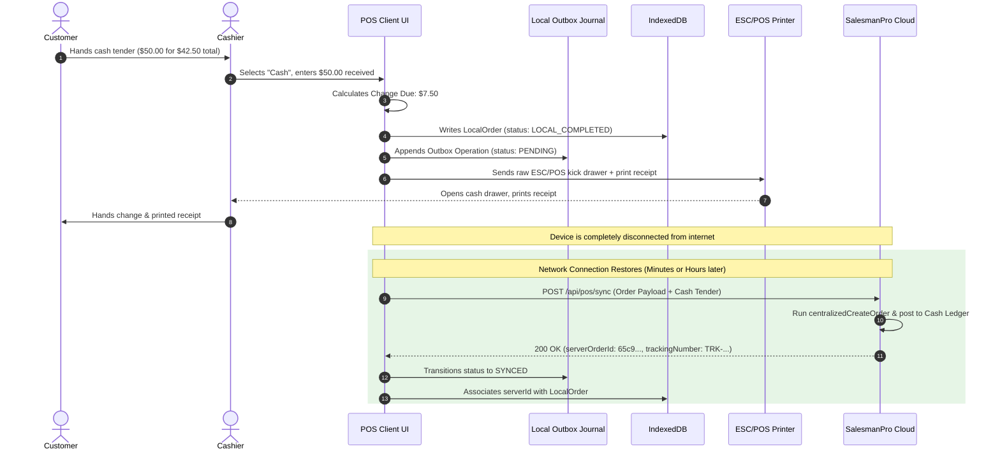

# SalesmanPro — Offline Payment Rules & Financial Safety

> **Document Version:** 1.0.0  
> **Status:** Authoritative Financial & Tender Specification  
> **Target Subsystems:** Payment Handlers, POS Cash Drawer, Financial Ledgers  

---

## 1. Tender Separation: Offline-Safe vs Online-Dependent

The POS must never blur the line between verified tenders and unverified external gateway claims:

```text
Tender Method              Offline Capability   Behavior When Offline
─────────────────────────────────────────────────────────────────────────────────────────────
Cash                       100% OFFLINE-SAFE   Accepted immediately. Cash drawer opens.
Manual M-Pesa Reference    OFFLINE-AUDITED     Cashier inputs MPESA Ref (e.g. QK8912KL). Flagged for back-office audit.
Standalone Card Terminal   OFFLINE-AUDITED     External bank terminal prints slip; Cashier enters Auth Code (e.g. 098412).
Store Credit / Account     OFFLINE-SAFE (Limit)Accepted up to pre-cached credit limit; local balance adjusted.
Split Bill (Offline Safe)  100% OFFLINE-SAFE   e.g. $20 Cash + $15 Manual M-Pesa.
─────────────────────────────────────────────────────────────────────────────────────────────
M-Pesa STK Push            STRICTLY ONLINE     DISABLED in UI. Tooltip: "Requires Internet Connection".
Stripe / Paystack Card     STRICTLY ONLINE     DISABLED in UI. Tooltip: "Requires Internet Connection".
PayPal / Digital Wallets   STRICTLY ONLINE     DISABLED in UI. Tooltip: "Requires Internet Connection".
Customer Refunds           STRICTLY ONLINE     DISABLED in UI. Cashier cannot disburse cash refunds offline.
```

---

## 2. Cash Checkout Lifecycle (Offline)



---

## 3. Order & Payment State Machine

```text
       ┌──────────────┐
       │ LOCAL_DRAFT  │ (Items in active cart)
       └──────┬───────┘
              │ Cashier presses "Complete Cash Sale"
              ▼
    ┌──────────────────┐
    │ LOCAL_COMPLETED  │ (Persisted in IndexedDB, receipt printed, drawer open)
    └─────────┬────────┘
              │ Written to Outbox Journal
              ▼
      ┌──────────────┐
      │ PENDING_SYNC │ (Awaiting network connection)
      └───────┬──────┘
              │ Connectivity Manager detects ONLINE & dispatches batch
              ▼
        ┌──────────┐
        │ SYNCING  │ (In-flight HTTP request to /api/pos/sync)
        └─────┬────┘
              │
       ┌──────┴─────────────────────────┐
       ▼                                ▼
[HTTP 200 Success]             [HTTP 4xx/5xx / Timeout / Conflict]
       │                                │
       ▼                                ▼
  ┌────────┐                       ┌──────────┐
  │ SYNCED │                       │  RETRY   │ (Backoff timer active)
  └────────┘                       └────┬─────┘
                                        │
                               ┌────────┴────────┐
                               ▼                 ▼
                       [Transient Error]   [Fatal Conflict]
                               │                 │
                               ▼                 ▼
                         ┌───────────┐    ┌─────────────────┐
                         │ PENDING_  │    │ REQUIRES_REVIEW │
                         │   SYNC    │    │ (Admin Console) │
                         └───────────┘    └─────────────────┘
```

---

## 4. Cash Drawer & Shift Reconciliation (X-Report and Z-Report)

Offline transactions directly impact physical money held in the drawer. The Shared POS Offline Engine enforces strict cash accountability:

$$\text{Expected Cash} = \text{Opening Balance} + \sum \text{Cash Sales} + \sum \text{Paid-In} - \sum \text{Paid-Out}$$

$$\text{Cash Variance} = \text{Actual Counted Cash} - \text{Expected Cash}$$

### Shift Accounting Lifecycle

1. **Session Opening:** Cashier counts initial float (e.g. $100.00). Persisted locally in `LocalPOSSession.openingCash`.
2. **Offline Operations:** Every completed cash sale increments `expectedCash` and `cashSalesTotal` locally.
3. **Mid-Shift X-Report (Audit):** The cashier can print an in-progress X-Report at any time without ending their shift. Shows total sales, count of transactions, and expected drawer balance.
4. **Shift Closing Z-Report:** At end of day, cashier enters `actualCountedCash`. The system calculates `variance` (over/short), marks the local session `CLOSED`, prints the official Z-Report, and locks the terminal.
5. **Reconciliation Sync:** Upon cloud sync, the session close record is posted to `prisma.posSession` with full audit breakdown. Variances greater than store threshold trigger an automatic supervisor notification.
