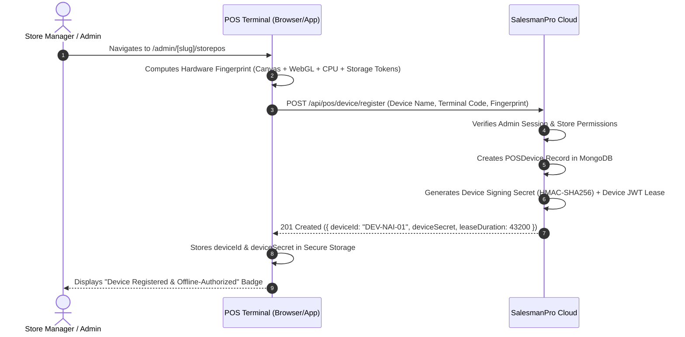

# SalesmanPro — Offline Security & Tenant Isolation Model

> **Document Version:** 1.0.0  
> **Status:** Authoritative Security Specification  
> **Target Subsystems:** Terminal Auth, Token Vault, Cryptographic Storage, Access Control  

---

## 1. Threat Vectors & Defense-in-Depth

Enabling offline operation introduces unique security challenges that online web apps never face:

| Threat Vector | Potential Attack | SalesmanPro Mitigation Architecture |
| :--- | :--- | :--- |
| **Physical Terminal Theft** | Attacker inspects IndexedDB / browser storage to extract customer PII or company financial data. | Database keys & customer PII are encrypted at rest using Web Crypto API (AES-GCM-256) with keys derived from operator PIN + device secret. |
| **Cross-Tenant Data Leak** | Cashier from Company A uses the same shared browser to open Company B's POS terminal. | IndexedDB databases are strictly named per tenant (`salesmanpro_pos_db_{companyId}_{storeId}`). Tenant ID is verified on every internal query. |
| **Stale Privilege Escalation** | Cashier fired on server continues processing sales offline for days. | Maximum offline lease duration (hard limit 12 hours). After expiry, the terminal requires online server re-authentication. |
| **Tampered Local Balances** | Attacker modifies price or stock in IndexedDB dev tools. | Critical payloads are signed with an HMAC token issued during session start. Server re-verifies pricing against canonical catalog upon sync. |
| **Replay Attacks** | Attacker intercepts a sync batch and attempts to resend it to duplicate orders. | Mandatory idempotency keys (`${deviceId}:${operationId}`) and monotonically increasing local sequences reject duplicates. |

---

## 2. Device Registration & Binding Ceremony

Before any POS terminal is allowed to cache catalog data or process sales offline, it must complete the **Device Binding Ceremony**:



---

## 3. Operator Authentication & Offline PIN Hashing

Operators log in with a 4-to-6 digit numeric PIN or login code. 

### Security Invariants

1. **Never Store Plaintext PINs:** The client never stores the raw PIN or server user passwords.
2. **PBKDF2 Client-Side Salted Hash:**
   $$\text{LocalHash} = \text{PBKDF2-HMAC-SHA256}(\text{PIN}, \text{StoreSalt}, \text{iterations} = 100,000)$$
3. **Offline Login Verification:**
   * When online, the server returns the salted PIN hashes for active store operators during initial catalog sync.
   * When offline, the operator enters their PIN. The client computes the PBKDF2 hash and compares it in constant time against the cached hash.
   * If matched, the operator is granted a local session with their pre-cached permission bounds (`maxDiscountPercent`, `canVoidOrders`).
4. **Local Rate-Limiting:** If 5 incorrect PINs are entered locally, the terminal locks out for 5 minutes.

---

## 4. Device Revocation & Remote Wipe Protocol

If a terminal is stolen or an employee is terminated under adverse conditions:

```text
Admin clicks "Revoke Terminal" in Super Admin Dashboard
                     │
                     ▼
         Server marks device REVOKED
                     │
         ┌───────────┴───────────┐
         ▼                       ▼
  [Terminal is ONLINE]     [Terminal is OFFLINE]
         │                       │
Heartbeat receives               │
{ status: "REVOKED" }            │
         │                       │ Operator continues operating
         │                       │ up to Max Lease (Max 12 hours)
         │                       │
         │                       ▼
         │                 Terminal attempts sync / Lease expires
         │                       │
         │                       ▼
         │                 Server returns HTTP 403 DEVICE_REVOKED
         │                       │
         └───────────┬───────────┘
                     │
                     ▼
        TERMINAL EXECUTES LOCAL WIPE:
        • Purges IndexedDB object stores
        • Clears sessionStorage & localStorage
        • Destroys cached operator credentials
        • Redirects to "Terminal Revoked" lockdown screen
```
