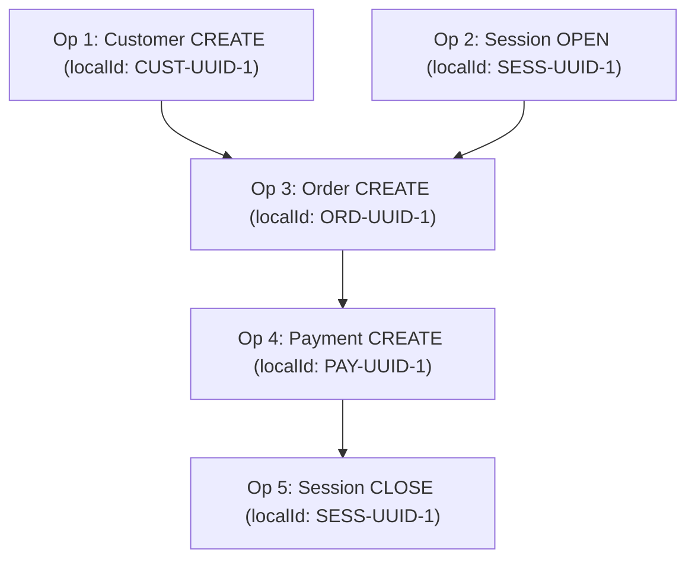

# SalesmanPro — Offline Synchronization Protocol

> **Document Version:** 1.0.0  
> **Status:** Authoritative Network Protocol Specification  
> **Target Subsystems:** Shared POS Sync Client, `/api/pos/sync`, Idempotency Engine  

---

## 1. Protocol Architecture & Lifecycle

Synchronization between an offline POS terminal and SalesmanPro Cloud operates as a **two-way, cursor-based push-pull pipeline**:

```text
LOCAL POS TERMINAL                                  SALESmanPRO CLOUD
==================                                  =================
        │                                                   │
        │ 1. Heartbeat Check (GET /api/pos/health)          │
        ├──────────────────────────────────────────────────►│
        │◄──────────────────────────────────────────────────┤ [Status: OK, Latency: 42ms]
        │    (Connectivity Manager sets ONLINE)             │
        │                                                   │
        │ 2. Outbox Batch Push (POST /api/pos/sync)        │
        │    Header: X-POS-Device-Id, Authorization         │
        │    Body: { operations: [Customer, Order, Pay] }   │
        ├──────────────────────────────────────────────────►│
        │                                                   │ (For each operation in DAG:)
        │                                                   │   • Idempotency check
        │                                                   │   • Run canonical service
        │                                                   │   • Decrement stock/ledger
        │                                                   │   • Generate server IDs
        │                                                   │
        │ 3. Push Acknowledgement                           │
        │    Body: { processed: [...], conflicts: [...] }   │
        │◄──────────────────────────────────────────────────┤
        │                                                   │
        │ 4. Incremental Pull (GET /api/pos/sync/pull)      │
        │    Query: ?sinceCursor=1042&storeId=ST-01         │
        ├──────────────────────────────────────────────────►│
        │                                                   │ Filter mutations where
        │                                                   │ revision > 1042
        │ 5. Catalog & Delta Payload                        │
        │    Body: { changes: [...], newCursor: 1089 }      │
        │◄──────────────────────────────────────────────────┤
        │                                                   │
        │ Update local IndexedDB with changes               │
        │ Advance local syncCursor to 1089                   │
        ▼                                                   ▼
```

---

## 2. Operation Dependency Graph (DAG)

Operations executed offline often have strict sequential dependencies. For instance, a cashier may create a new walk-in customer profile, immediately attach that customer to a sale, complete cash checkout, and end their shift:



### Dependency Ordering Rules

1. **Explicit Parent Referencing:** Every journal entry declares `dependencies: string[]` containing the `operationId` of preceding actions.
2. **Topological Sort:** The sync client performs a topological sort before grouping operations into dispatch batches.
3. **Cascade Halt on Dependency Failure:** If Operation 1 (Customer Create) fails with a fatal error, dependent Operation 3 (Order Create) is **NOT** sent to the server. Operation 3 remains in `PENDING` state until the conflict on Operation 1 is resolved or mapped.
4. **Local ID Remapping on Cloud Commit:** When Operation 1 succeeds and receives server `consumerId = "65b9..."`, the local sync engine dynamically remaps `consumerId` in Operation 3's pending payload before transmission.

---

## 3. Idempotency & The Critical "Lost Response" Protection

The most hazardous failure in distributed commerce is the **Lost Response**:

```text
POS Terminal                           Network Edge                    SalesmanPro Server
============                           ============                    ==================
     │                                      │                                  │
     │ 1. POST /api/pos/sync (Order #101)  │                                  │
     │    Idempotency-Key: DEV-01:OP-9988   │                                  │
     ├─────────────────────────────────────►├─────────────────────────────────►│
     │                                      │                                  │ 2. Executes Order #101
     │                                      │                                  │    Committed to MongoDB
     │                                      │                                  │    Stock decremented
     │                                      │                                  │    Cash posted
     │                                      │                                  │    Cached in Redis
     │                                      │    X Network Flap / Timeout      │
     │                                      │◄ - - - - - - - - - - - - - - - - ┤ 3. Sends HTTP 200 OK
     │                                      │   (Response lost in transit)     │
     │ X Request Timeout Error              │                                  │
     │ (POS does NOT know if order created) │                                  │
     ▼                                      ▼                                  ▼
```

### Mandatory Handling Guarantee

1. **Never Assume Failure:** If a network timeout or connection reset occurs during an in-flight push, the local journal moves the operation back to `PENDING` with an incremented `attemptCount`.
2. **Deterministic Idempotency Key:** When the sync client retries, it sends the exact same key:
   `Idempotency-Key: ${deviceId}:${operationId}`
3. **Server Replay Engine (`lib/idempotency.ts`):**
   * The server queries Redis and MongoDB for an existing order bearing `idempotencyKey = "${deviceId}:${operationId}"`.
   * **Crucial:** The server does **NOT** insert a duplicate order, does **NOT** re-decrement inventory, and does **NOT** charge twice.
   * The server immediately returns the previously recorded result (`HTTP 200 OK`, `alreadyExists: true`, order details, tracking number).
4. **Client State Transition:** The client receives the 200 OK, associates the server order ID with the local order, and transitions the journal record to `SYNCED`.

---

## 4. Exponential Backoff & Circuit Breaker

To avoid overwhelming degraded connections or thundering herd problems when power/internet returns to a store with 10 POS terminals:

```text
Initial Retry Delay: 2,000 ms (2 seconds)
Multiplier:          2.0
Max Retry Delay:     300,000 ms (5 minutes)
Jitter:              Full Jitter (random uniform between 0 and calculated delay)
```

$$\text{delay} = \text{random}(0, \min(300000, 2000 \times 2^{\text{attempt}}))$$

### Circuit Breaker Heuristics

* If 3 consecutive heartbeat or sync requests fail with DNS/Network timeouts, the sync client trips the circuit breaker to **OPEN**.
* In **OPEN** state, background sync is paused for 30 seconds. No user action is blocked. Checkout proceeds locally without delay.
* After 30 seconds, the breaker enters **HALF-OPEN** and executes a single lightweight probe (`GET /api/pos/health`). If successful, the breaker resets to **CLOSED** and resumes outbox flushing.

---

## 5. API Endpoint Specifications

### 5.1 Heartbeat Probe: `GET /api/pos/health`
Used by the client connectivity manager every 15 seconds (when active) or on network state changes.

* **Headers:** `X-POS-Device-Id: DEV-NAI-01`
* **Response (200 OK):**
```json
{
  "status": "healthy",
  "serverTime": "2026-09-25T12:30:00.000Z",
  "minClientVersion": "1.0.0",
  "latestRevision": 10429
}
```

---

### 5.2 Outbox Mutation Push: `POST /api/pos/sync`
Transmits a batch of pending offline operations (maximum 25 operations per batch).

* **Headers:**
  * `Content-Type: application/json`
  * `X-POS-Device-Id: DEV-NAI-01-A79F`
  * `Authorization: Bearer <offline_device_jwt>`
* **Request Payload:**
```json
{
  "deviceId": "DEV-NAI-01-A79F",
  "companyId": "65b91a7e2b109f0012345678",
  "storeId": "65b91a7e2b109f0012345679",
  "batchId": "BATCH-UUID-8899",
  "operations": [
    {
      "operationId": "OP-UUID-001",
      "entityType": "CUSTOMER",
      "operationType": "CREATE",
      "payload": {
        "localId": "CUST-UUID-1",
        "name": "Jane Wanjiku",
        "phone": "+254712345678",
        "email": "jane@wanjiku.co.ke"
      }
    },
    {
      "operationId": "OP-UUID-002",
      "entityType": "ORDER",
      "operationType": "CREATE",
      "dependencies": ["OP-UUID-001"],
      "idempotencyKey": "DEV-NAI-01-A79F:OP-UUID-002",
      "payload": {
        "localId": "ORD-UUID-1",
        "localReceiptNumber": "RCP-T01-20260925-0014",
        "trackingNumber": "TRK-20260925-8FA2",
        "customerLocalId": "CUST-UUID-1",
        "posSessionId": "65c010...",
        "operatorId": "65b822...",
        "cashierName": "Alice Cashier",
        "orderType": "PRODUCT",
        "orderSource": "IN_PERSON",
        "paymentOption": "cash",
        "items": [
          {
            "marketplaceListingId": "65bf33...",
            "quantity": 2,
            "price": 1500,
            "finalPrice": 1500,
            "subtotal": 3000
          }
        ],
        "totalPrice": 3000,
        "totalFinalPrice": 3000,
        "payments": [
          {
            "method": "cash",
            "amount": 3000,
            "amountReceived": 3000,
            "changeDue": 0
          }
        ],
        "clientCreatedAt": "2026-09-25T12:15:32.000Z"
      }
    }
  ]
}
```

* **Response Payload (200 OK / Partial Success):**
```json
{
  "success": true,
  "batchId": "BATCH-UUID-8899",
  "results": [
    {
      "operationId": "OP-UUID-001",
      "status": "SUCCESS",
      "serverEntityId": "65c84411aa99001122334455",
      "remapping": {
        "localId": "CUST-UUID-1",
        "serverId": "65c84411aa99001122334455"
      }
    },
    {
      "operationId": "OP-UUID-002",
      "status": "SUCCESS",
      "serverEntityId": "65c84412aa99001122334456",
      "trackingNumber": "TRK-20260925-8FA2",
      "alreadyExists": false
    }
  ],
  "serverRevision": 10430
}
```

---

### 5.3 Incremental Delta Pull: `GET /api/pos/sync/pull`
Fetches catalog changes, price updates, deleted items, and new customers modified since the terminal's last acknowledged cursor.

* **Query Parameters:**
  * `sinceCursor`: `number` (e.g. `10429`)
  * `companyId`: `string`
  * `storeId`: `string`
  * `limit`: `number` (default `100`)
* **Response Payload (200 OK):**
```json
{
  "success": true,
  "newCursor": 10450,
  "hasMore": false,
  "changes": {
    "products": [
      {
        "id": "65bf33...",
        "action": "UPSERT",
        "data": {
          "name": "Standard Wheat Flour 2kg",
          "sellingPrice": 220,
          "finalPrice": 220,
          "barcode": "616110123456",
          "quantity": 48
        }
      },
      {
        "id": "65bf99...",
        "action": "DELETE"
      }
    ],
    "categories": [],
    "customers": []
  }
}
```
